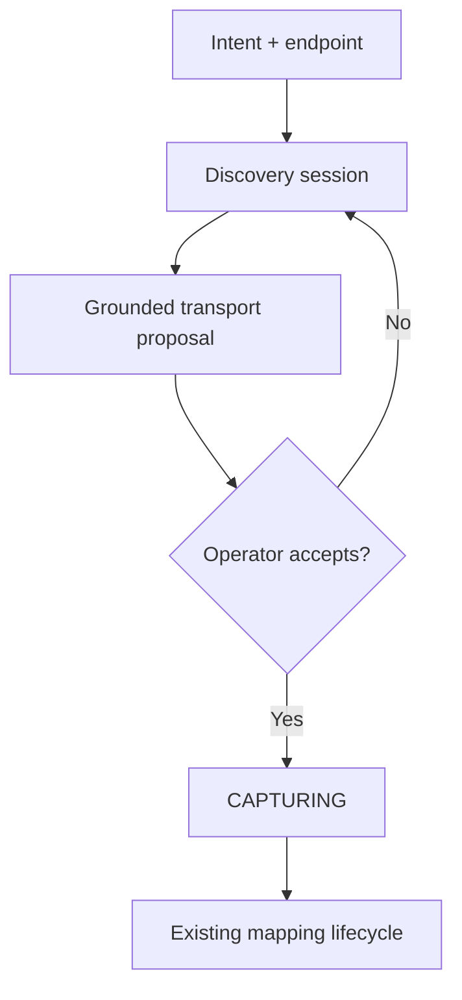

# ADR-0115: Conversational source discovery — one sentence, one endpoint, a scouted ingress

**Status:** Proposed — **revision 12**. Decision 3 is a real write; all decisions taken. **Usable from the console** for grounded sources. All questions settled; **reachable end to end**
(Decision 3, the operator plane, capability enforcement and the Phase 4b benchmark are implemented). **Phases 0–4 implemented** (§18, §19). Decisions 15 and 17
**signed off by the owner, 2026-08-03.**
**Date:** 2026-08-03
**Review:** `ADR-0115-CONVERSATIONAL-SOURCE-DISCOVERY-REVIEW.md` — *"Approve the product direction;
revise the architecture before implementation."* All ten blocking amendments are applied below and
mapped in §12.
**Owner directives (2026-08-03):** (a) the whole Ingress Studio programme is **premium** — zero new
OSS surface; (b) every artifact this produces is **modelled in the knowledge substrate**, not in a
private store; (c) **multi-step exploration is in scope from v1** — this overrides the review's
single-call scoping, and Decisions 7 and 15 are rewritten around it.
**Second review round (2026-08-03):** the reviewer withdrew the single-call restriction and supplied
the `DiscoveryAction` algebra, controller-issued handles, and the output-side capability model now in
Decisions 7 and 9. Revision 3's claim that injection could "at worst waste budget" was **wrong** and
is corrected in §9.
**Amends in part:** the "exactly one stage is a form" premise of the turn-17 handoff
(`operator_ui_refactor/ingress studio/design_handoff_cambrian_ux/README-ingress-studio.md` §2.1) —
the form becomes a prompt plus an endpoint.
**Related:** ADR-0090 (ingress system), ADR-0092 (propose-don't-enforce), ADR-0101 (config/secret
store), ADR-0105 (evidence foundation), ADR-0108 (event-shaped knowledge), ADR-0110 (kind registry),
ADR-0111 (typed query plane), ADR-0112 (Ingress Studio foundations), ADR-0063 (LLM-condition
injection hardening), ADR-0084 (conversation model), ADR-0080 (chat daemon), SEC-01 (agent
sandboxing).

---

## Context

### What an operator does today

Creating an ingress starts with a form. The operator declares the transport by hand — kind,
endpoint, cadence, auth placement — and only then does the lifecycle take over:

```
DRAFT → CAPTURING → MAPPED → DRY_RUN → ARMED
```

Everything after that first stage is already review rather than authoring, and it is good: the
drafter proposes a mapping from the schema profile and redacted samples, abstains per-field when it
cannot decide, and cannot save, transition or arm what it proposed. A decision the operator makes
becomes *guidance* and the drafter re-proposes, so there is **one path into the mapping rather than
two that can disagree**.

The form is the weak point. It asks the operator to already know what they are about to connect to:
whether the endpoint paginates, what its rate limit implies about a poll interval, whether the JSON
array at the root is the collection or an envelope. That knowledge is *in the endpoint*, and a
person acquires it by opening a terminal and probing — which is exactly the work a machine should
do.

### The ask

> *"I want the earthquake data from that endpoint."* — plus a URL. Cambrian inspects the source,
> works out what kind of thing it is, proposes how to read it, **asks the operator the questions it
> cannot answer itself**, and hands a configured ingress to the existing lifecycle.

### The architectural thesis

The review proposed a bounded single-call state machine. Owner directive (c) replaces it with a
genuine multi-step loop, and the thesis is amended to keep the review's *security* claim while
dropping its *scope* claim — the two are separable, which is the insight the original framing missed:

> Source discovery is a **versioned, budgeted exploration loop** over a security-owned probe
> capability. The model plans, reads observations and chooses what to look at next — but it emits
> **typed action requests that a Go controller validates and executes**, and it never controls an
> HTTP client. Its only output is a revisioned `TransportProposal`, grounded finding-by-finding in
> discovery evidence. Accepting that proposal is an operator command that enters the existing
> capture lifecycle.

Multi-step is not a luxury here. A single probe cannot establish that a pagination cursor is stable,
cannot find the collection under an API root, cannot choose among forty operations in an OpenAPI
document, and cannot walk an auth ladder. Discovery that stops at one probe automates only the
sources that were already easy to configure by hand.

**The boundary that matters is not "state machine versus agent". It is planner versus
capability-enforcing executor.** Adopted verbatim from the second review round:

> Source Discovery is a bounded agentic planning loop over a closed `DiscoveryAction` algebra. The
> model proposes actions but has **no direct network, credential, storage or lifecycle capability**.
> A security-owned controller validates every proposal against origin, method, credential scope,
> prerequisites, session revision and cumulative budgets before execution. Targets and continuations
> are referenced through **controller-issued handles derived from recorded evidence**. Results are
> preserved as restricted discovery evidence, then reduced to redacted observations before returning
> to the model. **Human-facing questions are independently capability-validated.** Budget exhaustion,
> policy refusal and abstention are **successful terminal outcomes**.

### What already exists that this builds on

| Capability | Where | Why it matters here |
|---|---|---|
| Lifecycle state machine with three human gates | ADR-0112 | Discovery must not add a fourth path around them |
| Propose-only drafter with per-field abstentions | `ingressstudio/drafter.go` | The question-asking discipline already exists; this generalises it |
| Guidance loop (decision → guidance → re-propose) | drafter | The answer-handling model adopted wholesale |
| Redaction at capture (values → type tokens) | `schema_profile.go: Redact` | Constrains what discovery may keep, and what any transcript may show |
| Write-only credential store | ADR-0101 | The only correct destination for a fulfilled secret |
| Three transports: poller, webhook, websocket | `transport_*.go` | The closed vocabulary discovery classifies into |
| Evidence, with class and retention | ADR-0105 | Probe material is evidence, and is fenced off from source evidence |
| Event-shaped knowledge, streams | ADR-0108 | Where discovery's own artifacts live |
| **Kind registry — kinds are DATA** | ADR-0110 | Registering discovery kinds needs **no OSS code**; gate was "fourth source by configuration alone" |
| Typed query plane | ADR-0111 | *"Why is the cadence 60 s"* is answerable without a bespoke API |
| Payload-as-data nonce fencing | ADR-0063 | Reading untrusted remote text safely |
| Conversation / Message model | ADR-0084, ADR-0080 | Durable, scoped, authorised transcript — as a **view** |
| One-column studio UI: receipts, preconditions, abstention rows, sticky bar | turn 17 | The surface this lands in; almost nothing new to design |

---

## Decisions

### 1. Discovery is a stage 0 whose only output is a proposal. Capture is not skipped.

Discovery produces a **proposed transport spec**. It does not open a stream, does not ingest, and
does not shorten the lifecycle. `CAPTURING` runs afterwards exactly as it does today.

It will be tempting to skip capture — discovery has *seen* the payload, after all. That is the
single most damaging shortcut available here. One probe response is not a sample: it cannot show
that `properties.updated` equals `time` in 41 of 214 deliveries, which is precisely the class of
finding the studio exists to surface. **Discovery shortens the form. It must never shorten the
evidence.**

Corollary: discovery is propose-only, on the same terms as the drafter — it cannot save, transition
or arm. The three human gates are untouched.

### 2. Transport-only for v1. Discovery does not map. *(Amendment 1)*

Revision 1 said "transport only" in the open questions while Decision 2 let the model choose fields
and map into the kind registry. That contradiction is resolved in favour of transport-only.

Discovery's entire output is:

```text
DiscoverySession
├── ProbeFindings        (grounded, §5)
├── TransportProposal    (revisioned)
├── OpenQuestions
└── OperatorIntent       (the sentence, recorded verbatim)
```

`TransportProposal` may carry: transport kind, origin/URL, cadence candidate, pagination mechanism,
collection root, authentication placement, protocol and format hints, capture parameters.

**It must not carry an ADR-0110 knowledge-kind mapping.** The operator's sentence and any
field-relevance observations travel forward as **guidance for the existing drafter**, consumed
*after* real capture. They are not a mapping and cannot skip the drafter's abstention process.

One mapping authority. Probe-time guesses never compete with mappings derived from actual samples.

**Where exploration does help the mapping — and it is the highest-value thing here.** A multi-step
session reads what a source says about *itself*: OpenAPI field descriptions, schema titles,
documented units and formats. That is exactly the knowledge samples cannot carry. A distribution of
values will never tell you that `updated` means *"time the event was revised"* — the docs will.

So discovery may emit **`documentation_hint` findings**, and they flow to the drafter as guidance,
under three constraints that keep §2's rule intact:

1. They are `inferred` findings at best (§5), never `observed`, and always carry the document they
   came from as evidence.
2. They are rendered as **candidate answers to the drafter's abstention rows** — *"the source's own
   documentation says this field is a revision timestamp. Accept?"* — never silently applied.
3. They are **untrusted text** (§7): a hint derived from remote content is marked as such, because
   documentation is exactly where an attacker would write a plausible lie, and because docs are
   routinely stale in ways samples are not.

This is the honest answer to "would multi-step exploration also learn the data transformation": it
does not *make* the mapping, but it can hand the operator a well-sourced answer to the question the
drafter had to abstain on — which is where most of the remaining manual work actually is.

### 3. Everything discovery produces is modelled in the knowledge substrate. *(Owner directive b)*

Discovery has **no private store**. Its artifacts are event-shaped knowledge (ADR-0108) in an
operational stream, and its probe payloads are evidence (ADR-0105).

**Two streams, one model:**

| Stream | Contents | Projects to knowledge? |
|---|---|---|
| `ingress:<id>` | The source's domain deliveries, mapped by the drafter's accepted spec | **Yes** — this is the point of the ingress |
| `studio:<ingress-id>` | Discovery's own artifacts: sessions, probes, findings, questions, decisions, proposals | **No.** Operational, queryable, never projected |

**Registered kinds** (premium-owned, registered as *configuration* per ADR-0110 — no OSS code):

| Kind | Carries |
|---|---|
| `discovery.session` | intent, policy versions, terminal outcome |
| `discovery.probe` | one probe, its evidence refs, budget consumed |
| `discovery.finding` | field, proposed value, epistemic status, confidence, `rule_id`, evidence refs |
| `discovery.question` | shape, prompt, options, status, dependencies, proposal revision |
| `discovery.decision` | the answer, who made it, when, the constraint it produced |
| `discovery.proposal` | one `TransportProposal` revision and its diff |

**Why this is the right shape, and not merely tidy:**

- **Supersession comes free.** A question invalidated by a new finding, a finding revised by a later
  probe, an answer rebased onto a new proposal — the substrate already models "this was true, then
  it was not", bi-temporally. Review §5.2's concurrency and revision requirements are substrate
  behaviour rather than new code.
- **The query plane answers the audit question.** *"Why is the cadence 60 s"* is a query over
  `discovery.finding` → evidence, not a bespoke endpoint.
- **Retention is per-stream**, which is exactly what amendment 3 asks for (§4).
- **No second store to keep in step** with the ingress's own state.
- **It costs no OSS surface**, because ADR-0110 made kinds data. This is what reconciles owner
  directive (a) with owner directive (b).

**The fence that makes this safe:** the `studio:` stream is **non-projectable by construction** and
can never be a source for `save_to_memory`. Discovery cannot create knowledge items about the world.
It creates knowledge items about *itself*. Gate 7 and gate 14 assert this.

### 4. Retention: the structured record persists with the ingress; the transcript does not. *(Amendment 3)*

If questions and decisions are the artifact and chat is only a view, then the artifact — not the
transcript — is what deserves lifecycle-aligned retention. Keeping a non-authoritative transcript
forever contradicts the claim that it is non-authoritative.

**Retained with the ingress, in the `studio:` stream:** operator intent; question records and
normalized answers/constraints; proposal revisions and diffs; finding-to-evidence references;
acceptance and transition receipts; decision-maker identities and timestamps.

**Retained under ordinary conversation retention:** the conversational paraphrase. It may be
summarized or pruned without changing the ingress artifact — and gate 12 asserts exactly that.

This reduces sensitive-data exposure and *proves* the structured record is authoritative rather than
asserting it.

### 5. Findings carry epistemic status, not false certainty. *(Amendment 7)*

Revision 1 called several things "measured findings" that are hints. A `Cache-Control: max-age` is a
cache freshness lifetime, not a recommended poll interval. An `X-RateLimit-*` is a ceiling. Two
`Last-Modified` observations do not establish a stable interval. A `200` does not prove auth is
unnecessary. A repeated-shape array is a collection *candidate*.

```text
Finding {
  field
  proposed_value
  status: observed | inferred | assumed | operator_confirmed
  confidence
  rule_id
  evidence_refs[]
  explanation
  policy_bounds?
}
```

Only `observed` values are presented as fact. An inferred cadence is shown as a candidate with
policy bounds and its exact basis. The absence of an auth challenge produces **`auth_not_observed`**,
never `no_auth` — that distinction is gate 8.

### 6. Transport, protocol and format are three axes. *(Amendment 8)*

Revision 1's rule table mixed them, which would have let the closed transport vocabulary become an
accidental closed *format* vocabulary.

| Axis | Values |
|---|---|
| **Transport** | `poller`, `webhook`, `websocket` — closed, refuses by name |
| **Protocol / API style** | ordinary HTTP API, GraphQL, WebSocket handshake |
| **Representation / format** | JSON, GeoJSON, RSS, Atom, OpenAPI-described |

GraphQL is not a fourth transport; it is a protocol. **It is not currently a usable poller protocol
either** — Phase 0 (§18) found the poller hardcodes `GET` with a nil body, so GraphQL sources are
refused by name in v1. GeoJSON is a format.

### 7. The model never owns an HTTP client. *(Amendments 5 and 6)*

Discovery calls a closed, security-owned command:

```text
ProbeSource {
  discovery_session_id
  target_url
  probe_kind                   // from a fixed enum
  credential_ref?              // reference only, never a value
  expected_proposal_revision
}
```

The model cannot choose methods, headers, bodies, redirect behaviour, proxy configuration or new
hosts. A deterministic controller decides which permitted probe comes next from recorded findings
and constraints.

**The loop is genuinely multi-step. The model proposes; the controller disposes.** *(Owner
directive, 2026-08-03 — supersedes the review's v1 scoping of a single-call state machine.)*

Revision 2 adopted the review's "bounded state machine with one model call". That is too weak for
real sources, and the owner is right to reject it. A single probe cannot establish that a pagination
cursor is *stable* (page 1 → cursor → page 2 is irreducibly iterative), cannot find the collection
under an API root, cannot choose among forty operations in an OpenAPI document, and cannot walk an
auth ladder from `401` to a token endpoint. Discovery that stops at one probe only handles sources
that were already easy to configure by hand — which is the least valuable half of the problem.

The security property is preserved by separating **what the model may ask for** from **what the
system will do**. The model is the *planner*; a security-owned controller is the *sole executor*.

### The `DiscoveryAction` algebra

```text
InspectDocument   (document_ref)
ListOperations    (openapi_ref)
SelectOperation   (operation_ref)
FetchTarget       (target_ref)
FetchNextPage     (continuation_ref)
RepeatProbe       (target_ref, delay_class)
ProbeWebSocket    (target_ref)
RequestCredential (auth_scheme_ref)
UseCredential     (credential_ref, target_ref)
AskQuestions      (question_proposals)      // proposals — validated, see §9
ProposeTransport  (...)
Complete
Abstain           (reason)
```

**Handles, not strings.** `target_ref`, `operation_ref`, `continuation_ref`, `document_ref`,
`auth_scheme_ref` and `credential_ref` are **controller-issued handles derived from recorded
evidence**. The model does not construct raw URLs, cursors, headers, request bodies or credential
placement. It selects among things the controller has already seen and minted a reference for.

This is stricter than revision 3, which still let the model author a path within an origin — a string
it could be argued into constructing. Handles remove that surface entirely.

**Where handles come from.** The controller mints them from three sources, all evidence-derived:
the operator-supplied origin (the root target); structural links found in recorded responses
(`Link: rel=next`, HAL/JSON:API link objects, OpenAPI `paths`); and a finite, versioned same-origin
candidate list. **A link found inside a payload is data**: it becomes a handle only after passing
origin policy, and never by the model quoting it back.

**A newly discovered origin is not a target.** It requires explicit policy evaluation and, normally,
operator approval before any handle is minted for it. Data on a sibling CDN host is a common and
legitimate case — and it is an operator grant, never a model decision.

**Auth is a typed adapter operation.** `RequestCredential` and `UseCredential` drive
controller-implemented auth adapters. OAuth and token exchange are **never** a model-authored POST.
The model sees credential *references* and fulfillment state; never values, never placement.

### What the controller checks, on every action

Pinned discovery-policy revision · allowed action type · current origin set · exact-origin credential
scope · method and operation safety · redirect and dial-time address policy · request, byte, time,
model-token and per-origin budgets · maximum exploration depth · **previously executed action
fingerprints** · prerequisite evidence · session and proposal revision · **whether the action can
produce new information**.

The last two deserve emphasis. **Repeated equivalent actions and cycles that add no evidence are
rejected**, which is what stops the model burning an entire budget re-trying one failed idea. To keep
this implementable rather than aspirational, "produces no new information" is defined concretely as:
an exact action fingerprint already executed in this session, or a fingerprint whose prior execution
returned a controller refusal for a reason that has not since changed. Anything cleverer is
best-effort and must not be a gate.

Every refusal is **named and returned to the model**, so a planner can adapt rather than guess.

### The loop

```text
recorded observations
  → model proposes a typed DiscoveryAction
  → controller validates capabilities and budgets
  → constrained executor performs the action
  → raw result stored as restricted discovery evidence
  → redacted observation returned to the model
  → repeat, ask, complete, or abstain
```

**Terminal outcomes that are successes, not failures:** budget exhaustion, policy refusal, and
abstention. A session that stops because it ran out of budget must say so and propose nothing — never
present a half-explored transport as finished.

### How the iterative cases resolve

| Case | Action path |
|---|---|
| **Pagination** | `FetchTarget` → `FetchNextPage(continuation_ref)` → compare cursor behaviour across pages |
| **API-root discovery** | Choose among controller-generated same-origin candidate targets |
| **OpenAPI** | `InspectDocument` locally → `ListOperations` → `SelectOperation` → probe only an eligible read-only operation |
| **Auth ladder** | Detect scheme → `RequestCredential(auth_scheme_ref)` → attach reference under exact-origin rules → `UseCredential` and retry |
| **Cadence** | `RepeatProbe(target_ref, delay_class)` — bounded conditional probes accumulating evidence, rather than inferring from one response |

Note that `delay_class` is an enumeration, not a duration: the model cannot ask the system to sleep
for twelve hours.

**Deterministic first, escalate on gaps.** A static GeoJSON feed must not cost six model calls. The
session runs the deterministic classifier first; only the *gaps* it reports open an exploration
loop, and a session that has no gaps proposes immediately. Exploration is the expensive path, taken
when it earns its cost.

**What multi-step costs, stated plainly:**

- **Reproducibility is traded for replayability.** A model loop is not deterministic. The mitigation
  is that the entire trajectory — every action, refusal and observation, in order — is recorded as
  evidence, so a session can be *replayed and audited* even where it cannot be *re-derived*. Model
  configuration is already pinned per proposal revision (§12).
- **The injection surface grows on two sides**, because each observation feeds the next decision.
  ADR-0063 fencing becomes load-bearing rather than precautionary for the input side — and the
  **output side needs its own capability model**, which §9 now carries. Provenance marking alone is
  not sufficient; see the correction there.
- **Cost and latency are per session, not per probe.** Budget model calls alongside bytes and wall
  clock; exhaustion abstains.
- **Quality becomes measurable, and must be measured.** A fixture suite of real APIs with
  known-correct transports, scored — gate 19.

**Network boundary** (application checks alone are insufficient):

- run probes in a dedicated process/network namespace or through a controlled egress gateway with
  **no route** to private or control-plane networks
- disable environment-derived proxies and ambient cookie jars
- HTTPS by default; HTTP requires an explicit operator decision
- restrict ports, schemes, URL userinfo, and redirect protocol changes
- **resolve, validate, then dial the validated IP** — never re-resolve at connect time; verify the
  connected peer address. "Resolve, check, then let the default client dial the hostname" has a
  DNS-rebinding/TOCTOU window
- cover IPv4, IPv6, IPv4-mapped IPv6, loopback, private, link-local, unspecified, multicast, and
  deployment-specific control-plane ranges
- cap DNS lookups, redirects, connections, **decoded and compressed** bytes, and wall time
- validate TLS normally against the intended hostname/SNI

**Credential scoping, stricter than Go defaults** (which forward sensitive headers to exact-domain
*and subdomain* matches):

- a credential is scoped to an exact origin — scheme, host, port
- **stripped on every redirect** by default
- never forwarded to subdomains automatically
- authenticating to a new origin requires explicit approval
- only the reference and scope are recorded, never the value

**Honest wording about safety** *(amendment in §3.4 of the review)*: HTTP defines `GET`/`HEAD` as
safe, but remote servers can violate that. The guarantee is therefore:

> Cambrian emits only permitted safe-method probes and never intentionally requests mutation. Remote
> server behaviour is outside Cambrian's transactional control.

**No recursive dereferencing.** External OpenAPI `$ref`s, response examples, callback URLs, server
URLs, feed links, embedded resources — all data, none fetched. No JavaScript execution. Any
same-origin well-known candidate list is finite, explicit, versioned, and charged against the same
budget.

Narrow consequences for two signals revision 1 listed carelessly:

- **OpenAPI discovery** starts at the exact supplied URL. `/openapi.json` and `/swagger.json` are
  conventions, not guarantees; `/.well-known/` is not a directory to sweep.
- **GraphQL introspection** conflicts with safe-method-only probing. v1 either sends one bounded
  GET-encoded introspection query when the endpoint explicitly appears to be GraphQL and fits all
  limits, or detects "possible GraphQL" and asks. It never silently POSTs a query body.
- **WebSocket** gets its own bounded probe type with no sustained stream — or, in v1, is inferred
  only from an explicit `ws:`/`wss:` endpoint with handshake verification left to capture setup.

### 8. A question is a first-class record. Chat is a view. *(Retained, strengthened)*

Every question has a home at the stage it belongs to, carrying: id, stage, shape, prompt, options,
status (`open` / `answered` / `superseded` / `withdrawn`), answer provenance, dependencies, and the
**proposal revision it was asked against**.

**If the column and the thread disagree, the column wins.** This is a tested invariant, not a
convention.

Concurrency, per amendment in review §5.2 — and, per Decision 3, mostly inherited from the
substrate: `proposal_revision_id` and `expected_question_version` on answer commands; idempotency
keys; atomic status transitions; automatic supersession when a new finding invalidates a question;
immutable decision history. **An answer against a superseded proposal is rejected or explicitly
rebased — never silently applied to the latest revision.**

### 9. Question shapes are closed, and `secret` is a schema-level capability path. *(Amendment 9)*

| Shape | Renders as | Answer goes to |
|---|---|---|
| `choice` | The existing abstention row — options plus explicit "none of these" | Constraint set |
| `confirm` | Yes/no with the consequence stated in the question | Constraint set |
| `free_text` | Input with typeahead over prior answers | Constraint set, **after normalization** |
| `secret` | Write-only field | **Credential service only — see below** |
| `do_then_tell` | Instruction + system-verified completion | Constraint set |

**A secret question has no answer field.** This is a schema-level union, not a convention:

- the browser submits **directly to the credential service**
- the conversation/question API never receives the secret
- the model never receives it
- the question stores only a fulfillment receipt or opaque credential reference
- logs, events and traces expose credential type, scope and attachment status only
- replacement or revocation creates a new auditable credential revision
- **the question closes when the reference is attached and, where possible, verified by a permitted
  probe** — not because a text answer claimed it was added

### Questions are capability-validated, exactly as actions are *(second review round)*

**Correction to revision 3.** That revision claimed a hostile source could "at worst waste budget".
**That is wrong**, and it was stated confidently twice. It holds only for the *network* boundary. A
source whose content steers the planner can still reach the operator through the question channel and
socially engineer them — *"paste your key here"*, *"run this command"*, *"disable that check"*.
Prompt injection that cannot reach a metadata service can still reach a person.

Marking provenance is necessary and **not sufficient**. `AskQuestions` therefore submits
**proposals**, and the controller validates them as strictly as it validates actions:

- **`secret` questions only for controller-recognized authentication schemes.** The model cannot
  invent a reason to ask for a credential; the scheme must have been detected by the classifier and
  minted as an `auth_scheme_ref`.
- **`do_then_tell` instructions come from reviewed templates**, parameterised by controller-issued
  handles — never arbitrary model prose. The operator-facing instruction text is authored by us, once.
- **A hard refusal set.** The model may never ask an operator to run a command, install software,
  upload a key or file, disable a protection, change a network or security setting, or send
  information anywhere. These are refused at validation, not filtered in the UI.
- **Any quoted endpoint content stays visibly source-originated**, so an operator always knows which
  voice they are reading.
- **A question generated downstream of untrusted content carries that provenance** to the row and to
  the thread.

A question proposal that fails validation is dropped with a named refusal returned to the planner,
recorded in the trajectory, and surfaced to the operator as a discovery-session event — because a
source that tried to make Cambrian ask for a key is itself a finding worth seeing.

**Free text still needs normalization** *(review §5.3)*: every free-text answer is parsed into a
typed constraint, or retained as guidance that cannot directly set stored transport fields. If
normalization fails the question stays open with a named reason.

**Assumptions are records** *(review §5.4)*: a reversible cosmetic assumption is stored explicitly as
an `assumption` with source, reason, affected field and replacement behaviour. Never a silently
filled blank.

### 10. An answer is a decision of record, and never a second path into the spec.

> `geometry.coordinates → lon, lat, depth` — *you chose this on 3 Aug; the drafter abstained because
> the payload documents neither ordering.*

An answer becomes a **constraint**; the session **re-proposes**; the operator sees the diff. Chat
never edits a spec directly. This is the drafter's existing discipline extended — one path in,
rather than two that can disagree.

The corollary is useful: an operator can volunteer something unprompted — *"actually it paginates,
use the cursor field"* — and it is simply another constraint, which may supersede a question the
session believed settled.

**Batching:** independent questions arrive together; serialize only when the answer changes what
would be probed next. Answers accumulate and the session re-proposes **once** — which also resolves
the turn-17 handoff's open question #2, because resolving the second abstention must never discard
the first.

### 11. Inbound sources: acceptance first, then the lifecycle mints. *(Amendment 2)*

Revision 1 let discovery mint an endpoint and secret and begin waiting — which is state-changing,
and contradicts propose-only. Corrected sequence:

1. discovery proposes `webhook` plus the required inbound configuration
2. the operator **accepts** the proposal
3. the lifecycle transitions the draft into `CAPTURING`
4. **a studio command — not the model —** mints the endpoint and credential
5. deliveries enter the normal evidence-first path
6. the first-delivery precondition resolves **from system evidence**, not from "tell me when done"

A `do_then_tell` question may walk an operator through configuring a third-party service, but it
closes only when Cambrian verifies the expected delivery or configuration state.

Temporary inbound endpoints require explicit expiry, tenant scope, rate limits, revocation, and a
state that prevents projection before the ordinary gates pass.

### 12. Discovery evidence is protected, versioned and non-projectable. *(Amendment 10)*

Probe material is auditable but is **not source data**. Documentation, error pages, login forms and
rate-limit responses must never reach knowledge projection.

Evidence class `discovery_probe`, non-projectable by default, in two layers:

1. **Restricted raw probe evidence** — kept where audit or re-derivation requires it; encrypted,
   under explicit retention and access policy.
2. **Redacted probe observations** — safe for deterministic rules, model context, UI and
   conversation.

Request credential values are never recorded. Response material is redacted: `Set-Cookie`,
auth challenges carrying tokens, signed redirect URLs, provider-specific secret headers. A finding
points at the protected record *and* the safe derived observation.

**Version pinning per proposal revision:** discovery policy version, rule-engine version, probe
implementation version, model configuration. Without it, re-derivation becomes impossible after any
code change.

### 13. Placement: entirely premium. Zero new OSS surface. *(Amendment 4 + owner directive a)*

ADR-0112 already places the studio in premium, with the plugin ID as the entitlement key. This
programme adds nothing to OSS:

- **Source discovery** — premium.
- **Question and decision records** — premium studio domain. Revision 1 proposed an OSS port on the
  grounds that questions might serve other propose-only agents; that is speculative, and both
  current consumers (discovery questions, mapping abstentions) belong to the studio. A generic
  question/decision port is promoted to OSS only when a second, *independent* core consumer
  demonstrates the same semantics — and then by its own ADR.
- **Discovery kinds** — registered as configuration against the existing ADR-0110 registry. No OSS
  code. This is what makes owner directives (a) and (b) compatible rather than opposed.
- **Substrate primitives** — Evidence, streams, kinds, the query plane — are *used*, not extended.

### 15. Where the loop runs: a sandboxed Python system agent, on a Go control plane. *(Owner directive, 2026-08-03)*

**Decided: the exploration loop is a Python system agent shipped inside the premium studio plugin.
Everything it is not allowed to get wrong stays in Go.**

Revision 2 recommended Go on the grounds that a single-call state machine had nothing for a Python
process to host. Decision 7 has since restored genuine multi-step exploration, which reverses the
conclusion — and, more importantly, changes *why*.

**The sandbox is the security argument, not a convenience.** A SEC-01-sandboxed agent runs under the
env allowlist and memory caps with **no egress of its own**. It cannot open a socket. Its only route
to the network is the `ProbeSource` command, across a process boundary, where the controller
validates every action. That turns "the model never owns an HTTP client" from a rule somebody could
erode into a property of the deployment — which matters far more once the model is steering a loop
rather than answering one question.

Split by **trust**, not by language:

| Concern | Home | Why |
|---|---|---|
| Probe execution, egress guard, dial-time enforcement | **Go**, security-owned | The security boundary; cannot live where the model runs |
| Action validation — origin, budget, probe kind, credential scope | **Go**, controller | Decision 7's containment depends on this being *outside* the agent |
| Deterministic classifiers | **Go**, plugin | Fixtures, no model, same test harness as the rest |
| Question/decision records, evidence and substrate writes | **Go**, plugin | Kinds, streams and evidence are Go-side |
| **Exploration loop — plan, read observations, choose the next action** | **Python**, system agent | Where iteration and prompt construction belong; sandboxed, versioned, swappable |
| Intent interpretation | **Python**, same agent | One place that reasons, rather than two |

**What this costs, stated plainly:** process boots per session (mitigated by exploration being the
escalation path rather than the default — §7), a second requirements surface under PLAT-01, and an
agent-manifest contract to keep in step with the `ProbeSource` schema. Accepted, because the
containment it buys is not otherwise available.

**The drafter stays in Go.** It is a different job — one generator call over captured samples, not a
loop — and moving it would be churn for nothing.

### 16. The planner's prior knowledge is inadmissible. *(Owner directive d)*

A language model has read the documentation for most public APIs. That is a liability here, not an
asset, and for a sharper reason than hallucination in general:

> **Recall is stale by construction.** An API that changed its schema, its cadence header or its
> pagination scheme after the training cutoff will be described *confidently and wrongly*. A
> confident wrong answer passes review; "I do not know" does not. Plausible-and-stale is the worst
> failure mode this design can have, because it is the one an operator will accept.

The requirement is therefore not "prompt it not to hallucinate". It is **structural**, in five layers,
of which the prompt is the last and weakest.

#### 1. Handles already prevent recall-driven navigation

This falls out of Decision 7 rather than being added. The model cannot type a URL, so it cannot act
on a remembered endpoint: there is no handle for `/fdsnws/event/1/query` unless the controller
observed it and minted one. **Recall cannot become a request.** The single most valuable property
here was already bought.

#### 2. Every finding cites evidence, and citations are verified

A finding with empty or unresolvable `evidence_refs` is **refused by the controller**, exactly as an
action with an unknown handle is. Verification is structural and cheap:

- the cited evidence record exists and belongs to **this session**;
- for a header-derived finding, the named header is **present in the cited response**;
- for a `documentation_hint`, the quoted text appears **verbatim, at a recorded offset**, in the cited
  document.

Verbatim quotation with an offset is the load-bearing detail. It makes a fabricated citation
mechanically detectable rather than a matter of reviewer diligence.

#### 3. The epistemic vocabulary has no slot for recall

§5's statuses are `observed | inferred | assumed | operator_confirmed`. **There is deliberately no
`recalled`.** A belief the planner holds but did not observe has nowhere to go in the type system, so
it cannot be carried into a proposal without becoming a lie about one of the four — which
verification (2) then catches.

`assumed` is not an escape hatch: an assumption is operator-visible, reversible, and carries its
source (§9), and "the model believed this already" is not an admissible source.

#### 4. Currency: findings are grounded in *this* session

"Up to date" made concrete. A proposal's findings must cite evidence probed **during the current
session**. Evidence from an earlier session may inform *planning* — it is legitimate to remember that
a path 404'd last week and not retry it first — but it may not **ground a finding** without being
re-observed. Re-running discovery therefore re-grounds; it does not inherit conclusions.

Every finding carries the timestamp of the evidence behind it, and the console shows it. A cadence
sourced from a header observed forty minutes ago is a different claim from one observed in March.

#### 5. The prompt — named as the weakest layer

Stated last on purpose, because a prompt is a request and the four layers above are constraints. The
planner is told, inside the ADR-0063 fence: *the recorded observations in this window are the only
admissible source of truth; your training data about this or any API is unreliable and may be
years out of date; a belief you did not observe in this session is inadmissible however confident you
are; abstaining is a success, and guessing is the one failure that cannot be caught downstream.*

That last clause matters because abstention is already a **terminal success** (§7). The system does
not merely permit "I could not determine this" — it treats it as a correct outcome, which is what
makes the instruction credible rather than decorative.

#### The gate that makes this measurable: adversarial fixtures

The benchmark (Phase 4b) includes **sources the model plausibly knows — deliberately altered.** Take a
well-known public API and change the fixture: rename a field, move the collection root, alter the
cadence header, change the pagination parameter.

**If the session proposes the real-world answer instead of the fixture's answer, it hallucinated**,
and the benchmark says so. This converts an unfalsifiable instruction into a number that can regress
— which is the only version of this requirement that survives contact with a model upgrade.

### 17. A dedicated system agent, on shared infrastructure — not the planner. *(Owner question, 2026-08-03; recommended, pending sign-off)*

**Recommendation: Source Discovery is its own system agent with its own controller. It does not go
through the kernel planner, and it is never routed through the auction.** It reuses the kernel's
*substrate* — agent runtime, sandbox, generator seam, tracing, conversation, evidence — and none of
its *control flow*.

#### This codebase has already decided this twice

- **Chat bypasses the planner.** ADR-0084 calls ADR-0080 "the architecture-of-record for *why* chat
  bypasses the planner", and records that the decision is not weakened by the conversation model.
- **The drafter touches neither planner nor auction.** It is called directly, holds its own repair
  loop and its own abstain shape. Source Discovery is the drafter's larger sibling: same
  propose-only posture, same guidance loop, more steps.

Two shipped decisions already say that model-driven proposal work in this system has a different
control structure from planned, routed execution.

#### Why the auction is actively wrong here, not merely unnecessary

Routing implies **substitutability**: several agents bid, one wins, any of them could have done it.
There is exactly one agent that can perform source discovery — and, decisively, **if a discovery step
could be routed then whichever agent won the bid could execute it**. That dissolves the capability
boundary of Decisions 7 and 9: the controller must be the *sole* executor, which means the work must
not be dispatchable in the first place.

#### Budgets are a different currency

A plan budget is tokens per plan. Discovery needs per-session and per-origin request counts, decoded
and compressed bytes, DNS lookups, redirects, exploration depth, wall clock and action fingerprints
(§7). These do not reduce to one another. REACT-02's global LLM ceiling still applies as an **outer**
bound — discovery cannot escape deployment-wide backpressure — but it enforces its own inner budgets.

#### The counter-precedent, addressed rather than avoided

ADR-0041 rejected "build an in-agent scheduler/planner for batching" because it "duplicates the
kernel Planner/DAG, bypasses per-step EFE selection + verification + budget, and violates the
single-planner / hexagonal principle". That is the correct rule, and it is exactly the argument
somebody building a rogue mini-planner would wave away. So the distinction is stated as a
**falsifiable test** rather than an assertion:

> Source Discovery has **no DAG, no per-step routing and no substitutable executors**. It is one
> stateful session over a closed action algebra against a single capability. **If it ever grows steps
> that could be routed to different agents, that is the signal it should have been a plan** — and it
> should be converted rather than defended.

It does not duplicate the planner because it does not decompose a goal. It selects the next action
in one conversation with one source.

#### What is reused, and what is not

| Reused from the kernel | Deliberately not reused |
|---|---|
| Agent runtime and SEC-01 sandbox; PLAT-01 manifest and requirements | **The planner** — there is no goal decomposition here |
| Generator seam, failover ladder, Langfuse tracing | **The auction / router** — one agent, and routing would breach the capability boundary |
| Conversation / Message (ADR-0084) for the thread | Generic step execution — only the controller executes |
| Evidence, kinds, streams, typed query plane | Plan-token budgets — wrong currency (see above) |
| REACT-02 global LLM ceiling, as an outer bound | Verifier pool — a proposal is reviewed by the operator, not scored by a verifier |

**Share the substrate, not the control flow.**

#### Composition later, without dissolving the boundary

If a future workflow wants *"set up these twelve ingresses"* as a plan, that composes cleanly: a plan
step calls the discovery **service**, which still owns its own loop, budgets and controller.
Composition happens at the service boundary — never by breaking discovery into routable steps.

#### The one real risk

Fragmentation: three model-driven subsystems (planner, drafter, discovery) drifting into three prompt
conventions, three budget vocabularies and three tracing shapes. The mitigation is the reuse column
above, treated as binding rather than aspirational — one generator seam, one tracing convention, one
outer ceiling.

**SIGNED OFF (owner, 2026-08-03)**, alongside Decision 15 which it completes: §15 said *what
language and what sandbox*; this says *what orchestration*.

### 18. Phase 0 result — the transport schema audit. *(Completed 2026-08-03)*

The blocking question was whether `TransportSpec` can **hold** what discovery finds. Answer:
**six of eleven finding types yes, five no** — and the five split cleanly into two that are additively
fixable and three that are not v1 work.

#### What the schema already holds

| Finding | Field | Notes |
|---|---|---|
| Transport kind | `Archetype` | `webhook \| poller \| websocket \| inbound` — the closed vocabulary of §6 |
| Origin / URL | `Poller.URL`, `Websocket.URL` | |
| Cadence | `Poller.IntervalSeconds` | The cadence candidate of §5 lands here |
| Collection root | `Poller.ItemsPath` | Empty = the whole body is one delivery |
| Delivery identity | `Poller.DeliveryRefPath` | Absent mints a unique ref |
| Cursor pagination | `Poller.CursorParam` + `CursorPath` | Param out, JSON Pointer into the response body in. Cursor discipline already enforces gaps-never |

That is a better starting position than expected: cursor discipline, collection root and
delivery identity — the three that would have been most painful to add — are already first-class.

#### Gap 1 — auth placement is not expressible *(blocking; fixed additively, see below)*

`CredentialBinding` is `{Name, SecretRef}` with **no placement**, and `transport_poller.go` derives
placement from the `Verifier` profile: `bearer_v1` sets `Authorization: Bearer`, `capability_url_v1`
sets a **fixed** `?cap=` parameter.

So an API key in `X-API-Key`, a custom query parameter name, or Basic auth **cannot be written down**.
Discovery would routinely detect an auth scheme it could not record — which is exactly the failure
Phase 0 existed to catch.

#### Gap 2 — no request headers *(blocking; fixed additively)*

The poller sends no headers. `Accept: application/vnd.github+json` and similar version-selecting
headers are inexpressible, and several major APIs require them to return the documented shape.

#### Gaps 3–5 — not v1 *(refused by name)*

| Gap | Why it is not additive |
|---|---|
| `Link: rel=next` pagination | The cursor model reads the next cursor from a **JSON Pointer into the body**. A URL-valued next-link in a *response header* has nowhere to go, and following it means a URL-valued cursor, not a parameter value |
| Offset / limit arithmetic | The cursor is opaque and copied; there is no arithmetic. Expressible only when the body literally carries the next offset |
| GraphQL as a poller protocol | The poller is hardcoded `GET` with a nil body. GraphQL needs POST plus a query document. **§6's claim that GraphQL is "usually a poller protocol" is false against the current runtime** and is corrected here |

Discovery **refuses these by name** in v1, consistent with §12: *"this source paginates through a
`Link` header, which this deployment's poller cannot follow."* A named refusal is a good outcome; a
silently wrong transport is not.

#### Decision taken: extend additively, do not redesign

Gaps 1 and 2 are fixed by **additive, backward-compatible fields**. Existing stored specs continue to
parse unchanged (they simply omit the new fields), and `DisallowUnknownFields` keeps the parse strict
for everything else:

```go
// CredentialBinding gains explicit placement.
Placement *CredentialPlacement // nil => the legacy Verifier-derived behaviour

CredentialPlacement {
    In    string // "header" | "query"
    Name  string // header or parameter name
    Scheme string // "" | "Bearer" | "Basic" — header only
}

// PollerConfig gains request headers.
Headers map[string]string
```

**Placement is nil-safe on purpose.** A spec written before this change keeps the exact behaviour it
has today, so this is not a migration — it is a widening. The three larger gaps are left alone rather
than half-solved, because a half-expressible pagination scheme is worse than a refusal.

### 19. Implementation status — Phases 0–3. *(2026-08-03)*

Everything below is model-free and orchestration-agnostic: it would be identical whichever way
Decisions 15 and 17 are signed off, which is why it was built first.

| Phase | State | Where |
|---|---|---|
| 0 — schema audit | **Done**, §18. Two gaps closed additively, three refused by name | `ingressstudio/spec.go`, `transport_poller.go` |
| 1 — question records | **Done.** Shapes, statuses, optimistic concurrency, supersession, secret union, normalization, batching. Bridged to the EXISTING drafter abstentions | `ingressstudio/question.go`, `question_bridge.go` |
| 2 — hardened probe | **Done.** Dial-time enforcement, origin set, budgets, redaction, credential stripping | `sourcediscovery/egress.go`, `dialer.go`, `probe.go` |
| 3 — deterministic classifier | **Done.** Three axes, epistemic status, citation verification, gaps-and-refusals | `sourcediscovery/finding.go`, `classify.go` |
| 4 — exploration loop | **Done.** Action algebra, controller, planner bridge, sandboxed agent | `sourcediscovery/action.go`, `session.go`, `planner_agent.go`, `agents/source_discovery_agent/` |

#### What the implementation taught us, beyond the audit

**The `Link: rel=next` refusal closes a loop.** The classifier detects header pagination and emits a
gap marked `Refusal: true` — meaning *no amount of further probing can fix this, because the schema
cannot express the answer*. That distinction matters: an ordinary gap opens a question, a refusal
ends the session honestly. Without Phase 0 the classifier would have proposed a body cursor for a
source that paginates by header, and silently missed records.

**A poller header map is a credential-at-rest hazard.** Adding `PollerConfig.Headers` created a place
an operator could paste an API key into a stored spec. `Authorization`, `Proxy-Authorization` and
`Cookie` are refused there by name, pointing at the credential store instead — a rule that did not
exist before the field did.

**`auth_not_observed` needed to be the *only* possible output**, not the polite one. The classifier
has no branch that can produce `no_auth`; the value does not exist in the code. Gate 8 is therefore
structural rather than a convention somebody maintains.

**Dial-time enforcement is not one check.** It is: validate the literal if there is one, charge the
lookup, validate *every* returned address, dial the validated address **by IP**, then re-validate the
peer that was actually connected to. Skipping any step reopens the window. The tests are written as
the attacks — a resolver that answers differently the second time, and one that returns a public and
a metadata address together.

#### Test coverage of the gates

37 tests in `sourcediscovery`, race-clean. Gates now covered by an executable test: 2 (dial-time
validation and peer check), 3 (IPv6, IPv4-mapped, ports, userinfo, downgrade), 4 (credentials never
cross a redirect), 5 (compressed and decoded both budgeted), 8 (`auth_not_observed`), 9 (cadence is a
candidate with bounds), 11 (concurrent answers), 25 (no model-authored URL, header, body or method —
the action struct has no field for one), 27 (budget exhaustion is its own outcome), 31–32 (evidence
citation, verbatim quotation at offset), 36 (no `recalled` status).

### 20. Phase 4 as built — what the implementation settled. *(2026-08-03)*

#### The planner is an agent with no tools

The strongest available expression of Decision 7. `source_discovery_agent` is a `CognitiveAgent`
whose manifest declares `"tools": []`, and whose `think()` runs with `max_tool_rounds=0` and
`max_memory_queries=0`. Its entire output is one JSON `DiscoveryAction`.

It cannot open a socket, read a file, resolve a name or touch a credential. The controller enforces
that at the other end regardless — a planner cannot acquire a capability by asking for one — but a
planner that cannot even *attempt* a tool call produces a cleaner trajectory to audit.

`max_memory_queries=0` is Decision 16 in the agent's own configuration: memory of a previous session
may inform a human, but it may not ground a finding.

#### Handles carry labels, not URLs

The view hands the planner `{"t1": "/all_hour.geojson"}`, not the address. That is the difference
between a planner that selects among things the controller has seen and one that could quote an
address into a question or a proposal. Tested.

#### The action struct has no field for a URL, method, header or body

Gate 25 turned out to be a *type* property rather than a runtime check. A planner that emits
`{"kind":"fetch_target","url":"http://169.254.169.254/...","method":"POST"}` has those keys silently
dropped, because the wire shape has nowhere to put them. There is no validation to forget.

#### Fence markers are per-view nonces

A fixed marker can be closed by content that guesses it. `renderView` mints a random marker per call,
so a payload cannot end the data region and begin issuing instructions. Tested by rendering the same
view twice and asserting the markers differ.

#### Terminal actions are recorded before they terminate

A bug the tests caught: `abstain`, `complete` and `propose_transport` returned before the trajectory
was written, so the session lost **the action that ended it** — the single most important one to
replay. Gate 21 would have passed a session it could not actually reconstruct.

#### `repeat_probe` is exempt from no-progress detection

Repeating is its whole purpose: a cadence is grounded by probing twice. Every other kind is refused
on an identical fingerprint, which is what stops a planner burning the budget on one idea.

#### The wiring lives in the studio, not in the boundary

`sourcediscovery` depends on nothing but the standard library, on purpose. `PlannerInvoke` — which
knows about `domain.Handoff` and the agent manager — lives in `ingressstudio`. A boundary package
that imported the kernel's agent surface would acquire its dependency graph, and the next caller
would find that natural.

The handoff carries **no `Context` and no `WorkingMemory`**: the fenced view is the whole world the
planner may reason from, and anything alongside it would be a second, unfenced source of belief.

**65 tests in `sourcediscovery`, race-clean; whole premium module green, gofmt and vet clean.**

### 21. Reachable — substrate, plane, capabilities, benchmark. *(2026-08-03)*

Phases 0–4 built the engine. This is what made it usable, and what the wiring taught.

#### Decision 3 as configuration, exactly as claimed

Six kinds — `discovery.session/probe/finding/question/decision/proposal` — declared through
`r.AddKnowledgeKinds` in the plugin's `Register`. **No OSS change**, which is the claim that
reconciles "whole programme premium" with "model everything in the substrate", and there is now a
test that fails if it ever stops being true.

`Projectable()` is the fence, and it is a **prefix test rather than a list**: the `studio:` stream
cannot project, so a new discovery kind cannot acquire projection by being declared somewhere else.

#### Five RPCs, split along the capability boundary rather than by convenience

`StartDiscovery` · `GetDiscoverySession` · `AnswerDiscoveryQuestion` · `ApproveDiscoveryOrigin` ·
`AcceptDiscoveryProposal`.

They could have been three. They are five because `approve_origin` is not implied by `run` and
`accept_proposal` is not implied by `answer` — collapsing them would have made D-Q4 unenforceable at
the only layer that matters. Each non-implication has its own test.

#### The posture when authz is not wired

`PrincipalFor` is nil in the plugin today, and the plane **refuses every command with a named
reason** rather than running unattributed. The boot log says so explicitly.

The alternative — permitting everything until authz arrives — is how an unauthenticated write plane
ships: it works in dev, and nobody notices the gap because nothing fails.

#### What the wiring caught

**Findings cited nothing.** The plane did not set the session's evidence store, so every observation
was anonymous and gate 31 refused the lot. The correct failure, surfacing exactly where it should —
and it stayed invisible until something end-to-end ran, because every unit test supplied its own
store.

**A spec is parsed twice on the way in.** Discovery round-trips its proposal through
`ParseTransportSpec`, and the store parses again before writing. Deliberate: the store is the last
place a malformed spec can be stopped before it becomes a revision somebody later rolls back to.

**Accepting a non-poller proposal refuses by name.** Websocket and webhook need their own fields, and
inventing defaults would produce an ingress that looks configured and is not.

**Accept blocks on open questions.** Every discovery question is material by construction — transport,
auth, pagination, cadence and collection root are all on D-Q2's blocking list — so there is no
cosmetic case to allow through here.

#### Phase 4b — the benchmark, and proof it can fail

Six fixtures, **33 checks, 100%, zero hallucinations**. Scored: transport accuracy, format, cadence
(including *"propose nothing when nothing grounds it"*), collection root, auth phrasing, gaps that
must stay open, and refusals that must be named.

**Proven non-vacuous.** Breaking one rule — defaulting the cadence to 60 seconds when nothing grounds
one — fails three fixtures with *"HALLUCINATION: invented a cadence with nothing to ground it"*. A
benchmark nobody has watched fail is a benchmark nobody should trust.

`TestRecallTrapsExistAndAreDistinguishable` guards the guard: a suite whose fixtures all agree with
the real world measures nothing about recall and would pass forever while the property rotted.

**On fixture provenance, honestly:** these are hand-authored shapes, not captures from live APIs.
Sound as a benchmark — the fixture is ground truth by construction — but weaker than recorded traffic
in one way: it cannot surprise us with a shape nobody thought of. Real captures should be added as
the studio's own capture stage produces them.

**211 tests across `sourcediscovery` and `ingressstudio`, race-clean; whole premium module green.**

#### Still not done

Phase 5 (UI and conversation projection), Phase 6 (inbound capture handover), the durable write
inside `recordDiscoveryArtifact` (the seam exists and is a no-op pending the substrate consumer
slice), agent registration in the deployment's manifest, and `PrincipalFor` once authz is wired.

### 22. Phase 5 — the create path, and two things it exposed. *(2026-08-03)*

The studio's one remaining form is gone. `DiscoverSource` asks for a sentence and an endpoint;
everything after is review.

**Rust client + 5 Tauri commands + TS bindings + the stage**, wired into the turn-17 column: the
`source` stage now renders discovery instead of "the transport lives on the specs surface".

What the screen has to get right, and is tested for:

- **An inferred value reads as a candidate WITH ITS BASIS.** "every 60 s — from Cache-Control:
  max-age=60, which is a cache freshness lifetime, not a stated update frequency" plus its bounds.
  Only `observed` and `documented` read as fact.
- **A refusal is not a to-do.** `Link`-header pagination renders under *"This deployment cannot
  ingest that"*, separately from *"Still open"*. Showing them alike sends an operator hunting for a
  setting that does not exist.
- **Abstention is an answer**, headlined *"Cambrian stopped rather than guess"*. Rendering it as an
  error teaches distrust of the one always-honest outcome.
- **A question phrased from source text says so.** A secret question offers **no field at all** — it
  points at the credential store.
- **A new origin is a decision**, granted exactly (scheme, host, port), never a domain suffix.

#### D-Q4 amended — role-level attribution, for now *(owner, 2026-08-03)*

The operator interceptor authenticates every call and denies mutating RPCs to viewers, so the
operator/viewer split **is** enforced. But it stores the principal under an INTERNAL context key
(`core/internal/.../operator.PrincipalFromContext`) that premium cannot import, and the public
`domain.WithPrincipal` is not populated on that plane.

So today: the finer D-Q4 separations are not enforced (every operator holds all six), and
*"every command records the acting principal"* records the **role, not the person**.

**Decided: record the role.** A named-principal seam is not worth an OSS addition today, so
`discoveryPrincipal()` attributes to `operator` and the finer D-Q4 separations wait for a role model
that can express them.

What this does and does not concede:

- **Kept.** The operator/viewer boundary, enforced by the interceptor before any handler runs. The
  capability checks themselves — `Require` refuses by name, every non-implication is tested,
  `RequireAuthenticatedProbe` needs two rights. Raw probe evidence is withheld even from an operator,
  because "can configure ingresses" is not "may read everything a third party sent us".
- **Conceded, knowingly.** *"Every command records the acting principal"* records the role. A
  decision record will say `operator` where it should say a name, and six weeks later "who chose
  this" has a weaker answer than the design intends.

The concession is cheap to reverse precisely because the separations were built rather than skipped:
**only `discoveryPrincipal()` changes.** Had the checks been dropped as premature, nothing would have
put them back.

#### ~~Gap 2~~ — CLOSED: the planner registers through ADR-0075

The seam already existed and was already in use. `Registry.AddAgentSource` +
`app.NewFilesystemAgentSource(dir)` is how a plugin contributes its OWN agents directory, and the
telegram plugin has been doing it since ADR-0090.

The planner moved to `plugins/ingressstudio/agents/source_discovery_agent/` — the package shape the
scanner already walks (a subdirectory containing `agent.py`) — and the plugin contributes the
directory in `Register`, following the telegram convention exactly rather than inventing a second one
for the same job.

Verified on a live boot:

```
ingress-studio: contributed the source-discovery planner  dir=…/plugins/ingressstudio/agents
DB (BBOLT): seeding new agent  id=source_discovery_agent
ADR-0075: registered agent from source  id=source_discovery_agent  system=false  manifest=true
```

`system=false` is correct and worth noting: a plugin directory can never confer system privilege —
that needs an explicit `AddSystemAgent` grant — so the planner runs as a regular sandboxed agent,
which is exactly the posture Decision 15 depends on.

A missing directory is a WARNING, not an error: the deterministic path needs no planner, so a
deployment without it still discovers grounded sources and the log says precisely what is lost.

### 23. Decision 3 made real — the substrate write. *(2026-08-03)*

`recordDiscoveryArtifact` was a no-op with a comment promising a later slice. That made Decision 3 a
claim rather than a property: supersession, the query plane and per-stream retention are all things
the substrate does, and it does none of them for data nobody wrote.

It now writes through `svc.Knowledge.PutItem`.

**The namespace is the fence.** Every item lands in `studio:<ingress-id>`. Writing into a projectable
namespace is **refused, not redirected** — quietly moving a misrouted item would hide the bug that
sent it there.

**Values are typed against the declared predicates.** `confidence` lands as a number, `observed_at`
as a date, `status` as text — read from the same `KindSpec` the plugin registers, so the declaration
has exactly one source. An **undeclared predicate is refused rather than dropped**: a dropped value
is invisible data loss, and here the dropped value would be the reason a mapping looks the way it
does.

**Entity identity supersedes rather than duplicates.** A finding about the cadence is one entity
however many times a session revises it, which is what lets the substrate answer "what did we
believe, and when" without discovery keeping a private history — the whole point of Decision 3.

Eight tests, including *"every declared kind can actually be written"*: a kind declared but
unwritable is a kind whose artifacts vanish, and that would otherwise surface as one silently missing
row type.

### 14. Naming: **Source Discovery**. *(Review §10)*

Neither `Scout` (collides with the orchestration lane) nor `Prospector` (forces a metaphor into
durable event names). The plain term is clearer to operators and stable in the API vocabulary:

```text
source_discovery.started
source_discovery.probed
source_discovery.question_opened
source_discovery.proposed
source_discovery.accepted
source_discovery.abstained
```

---

## The procedure, end to end

**1 — The operator states intent.** A sentence and a URL. The sentence is recorded verbatim as
`OperatorIntent` — not a spec, but the thing the proposal is judged against and the reason later
readers get for why the transport looks as it does.

**2 — The session probes, under budget, through the constrained capability.** `HEAD`, then `GET`.
Every request and response pair becomes `discovery_probe` evidence in two layers.

**3 — Deterministic classifiers derive findings.** Transport, protocol and format on separate axes;
each finding carries its epistemic status, confidence, rule id and evidence refs.

**4 — One model call interprets intent against safe observations.** It sees redacted observations
inside an ADR-0063 fence. It proposes naming and relevance ordering — **not a mapping**.

**5 — Uncertainty becomes batched questions.** A `401` becomes a `secret` question and a stage
precondition: *"needs a bearer token — add one and this continues on its own."*

**6 — The operator answers.** Answers become constraints; the session re-proposes once; the diff
between proposal revisions is visible.

**7 — Acceptance is an operator command.** The transport spec is saved as a revision. Stage 0
collapses to a receipt carrying its finding — `poller · every 60 s (candidate, from Cache-Control)
· auth not observed · collection at /features`. The lifecycle proceeds to `CAPTURING`, unchanged.
For inbound sources, this is where the endpoint is minted (§11).

**8 — Mapping, as today.** The existing drafter takes over from real captured samples, carrying the
operator's intent forward as guidance. Its abstentions are the same question records, in the same
rows, answered the same way. From here nothing in this ADR applies — which is the point.

### Lifecycle



**Ownership rules.** Discovery attaches to a *draft ingress*; it is not an alternative lifecycle. The
security-owned prober performs network actions. The deterministic classifier derives findings from
recorded observations. The model interprets intent and proposes human-facing guidance. An operator
command accepts and saves a transport revision. Ordinary ingress machinery owns endpoint creation
and capture. The existing drafter owns mapping once real evidence exists. **Nothing in discovery
writes to the ADR-0108 domain knowledge substrate.**

---

## Where it lands in the UI

Almost nothing new is designed. Turn 17's vocabulary already covers it:

| Discovery concept | Existing turn-17 element |
|---|---|
| Session conclusion | Stage 1 **receipt carrying its finding** |
| Ungrounded value | **Abstention row** with typed options |
| Missing credential | **Precondition row**: "needs a bearer token — add one and this opens on its own" |
| Open question count | The **sticky bar**'s "N decisions left" |
| Probe trace | A log view, same pattern as the pipeline step trace |
| Finding epistemic status | Tone and wording: `observed` reads as fact, `inferred` as a candidate with its basis |

The conversation thread docks at the **bottom of the column**, expanding upward over the stages —
**never over the evidence pane**, which stays pinned because it is the material every claim is
checked against.

---

## Implementation plan

Ordered so each phase is useful alone and the risky parts are proven before the expensive ones.
Phases 0–3 contain no model at all.

| # | Phase | Contents | Ends in |
|---|---|---|---|
| **0 ✅** | **Expressiveness + threat-model audit** — *schema half complete, §18* | Transport-schema audit (can it *hold* cursors, auth placement, collection root, derived cadence?); exact `TransportProposal` schema; finding epistemic states; probe capability contract; URL/origin/credential scoping rules; discovery-evidence classification and retention; permission model for probing and credential attachment; the `studio:` stream and kind registrations | **An amended ADR, not code** |
| 1 ✅ | Question records, in premium | Back the *existing* drafter abstentions with versioned questions — proving the model on something already shipping. Optimistic concurrency, supersession, typed constraints, secret-question union, normalized decision history. **No OSS port** | Working studio, no behaviour change |
| 2 ✅ | Hardened probe service | Network boundary, adversarially tested, independent of model and UI. Network isolation plus dial-time enforcement. Emits restricted raw evidence and safe observations | A capability, callable by nothing yet |
| 3 ✅ | Deterministic classifier | Over recorded fixtures only. Transport/protocol/format separated; grounded findings with confidence; abstention is a valid result | Fixtures pass, no model |
| 4 ✅ | **Exploration loop** | The Python system agent (§15) over 2+3. Typed action grammar, controller validation, budgets, trajectory-as-evidence, batched questions, constraint accumulation, proposal revisions, explicit acceptance. Deterministic path first; the loop opens only on reported gaps | End-to-end poller creation, including a paginated source |
| 4b | **Benchmark** | Fixture suite of real APIs with known-correct transports, **including deliberately altered fixtures of well-known APIs** to catch recall (§16). Score transport accuracy, cadence sanity, abstention rate, hallucination rate, probes and model calls per session. **A regression here blocks release**, not just a review | A number that can go down |
| 5 ⏸ | UI + conversation projection | Questions inline and in the ADR-0084 thread. Prove transcript pruning does not change the artifact. Secrets routed directly to the credential service | The turn-17 column, filled in |
| 6 ⏸ | Inbound capture handover | After acceptance, the lifecycle mints the endpoint and enters `CAPTURING`. Operator setup verified from delivery evidence | Webhook path |

**Not code generation.** ADR-0112's v1 rule holds: *configuration, not code*. Discovery
parameterises human-written generic transports. It never emits a transport.

---

## What this deliberately does not do

- **No arming.** Three human gates, unchanged.
- **No capture shortcut.** §1.
- **No mapping from discovery.** §2.
- **No knowledge items about the world.** Discovery describes only itself. §3.
- **No general HTTP client for the model.** §7.
- **No recursive fetching** of references, links or embedded resources. §7.
- **No new transports.** Refuses by name.
- **No Slack/email as sources in v1.** OAuth app install, tenant consent, per-workspace scopes — an
  integration project, not a discovery feature. Named as a refusal until then.
- **No secret in any transcript, event, trace, log or model input.** §9.
- **No OSS surface.** §13.
- **No chat-first product.** The thread is a means; the column is the surface.

---

## Settled — the last six questions *(owner, 2026-08-03)*

All six are decided. Recorded here in full because several carry refinements that are stricter than
the recommendations they answer, and the reasons are the part worth keeping.

### D-Q1 — Questions belong to a draft revision, never to an armed ingress

A session may ask questions **only while a revision is being drafted**. A question attaches to that
specific draft revision — never directly to the armed ingress, and never to an immutable armed
revision.

Runtime drift on a live source may produce an **alert**, a **named refusal**, a **revision
suggestion**, or a **pre-populated draft fork**. It must **not** begin an unsolicited question
workflow against the armed ingress. An operator explicitly opens or accepts the revision draft before
any question becomes active.

> This keeps *"the source changed"* separate from *"the system is asking permission to change
> production."* Those are different sentences and they deserve different surfaces.

### D-Q2 — Material uncertainty blocks; only presentation may proceed on an assumption

The criterion, stated once so it can be applied rather than argued:

> A question may be non-blocking **only when an incorrect assumption will be visibly and
> automatically discoverable before it can change external behaviour, captured evidence, knowledge
> projection, security, or durable identity.**

**Blocking:** origin, path, operation, transport · authentication and header placement · pagination ·
cadence · collection root · field semantics and coordinate ordering · anything entering mapping or
projection.

**Non-blocking, and limited to presentation:** display label · description · optional UI grouping.

**The stream-name trap — a correction to the recommendation this answers.** "Stream name" is cosmetic
*only while it is a display name*. The moment it becomes a routing key, a stable identifier, a metric
label or a reference used elsewhere, it is **durable identity** and it blocks. The earlier
recommendation treated it as cosmetic unconditionally, and that was wrong.

Every non-blocking assumption records: `field`, `assumed value`, `reason`, `source`, `created_at`,
`replacement behaviour` — and stays **visibly marked** until confirmed or changed.

### D-Q3 — No new-origin pre-approval in v1

**The origin the operator submitted is the session's initial grant.** It is not a "new origin" and
needs no approval. Everything after it does.

Every subsequently discovered origin requires an **explicit per-ingress/session grant**, including
origins reached through: redirects · OpenAPI `servers` · external references · pagination links ·
authentication and token endpoints · WebSocket endpoints · documentation links.

**No approval by registrable domain or subdomain relationship.**

If tenant allowlists arrive later they start with **exact origins — scheme, hostname and port** —
never domain suffixes. And:

> **An origin allowlist must not imply credential authorization.** Credential scope stays a separate
> exact-origin decision.

That separation is the sharper half. Being allowed to *look* at a host is not being allowed to
*authenticate* to it, and collapsing the two would hand a permitted origin whatever credential the
session happens to hold.

### D-Q4 — Separate capabilities, not one "studio operator" permission

```text
source_discovery.view
source_discovery.view_raw_evidence
source_discovery.run
source_discovery.answer
source_discovery.attach_credential
source_discovery.approve_origin
source_discovery.accept_proposal
```

| Role | Holds |
|---|---|
| Viewer | the structured redacted artifact and the thread |
| Editor / operator | start discovery, answer non-secret questions |
| Credential manager | attach or replace credential references |
| Publisher / owner | approve new origins, accept a proposal into `CAPTURING` |
| Restricted auditor / admin | inspect protected raw probe evidence |

**The combinations that matter, stated so they cannot be assumed away:**

- An **authenticated probe requires both** permission to run discovery **and** authority to use the
  attached credential.
- `approve_origin` is **not** implied by `run`.
- `accept_proposal` is **not** implied by `answer`.
- Reading the ordinary thread does **not** grant access to raw probe evidence.
- Every command records the acting principal and is checked **server-side**.

### D-Q5 — Three retention classes, and a tombstone

| Class | Retention |
|---|---|
| Restricted raw probe evidence | Short, configurable, from session termination. **Never pruned during an active investigation or hold** |
| Redacted observations, findings, questions, constraints, proposals, decisions | Lifecycle-aligned with the ingress |
| Conversation transcript | Ordinary conversation retention; pruning cannot alter the artifact |

**The refinement that makes this work.** When restricted raw evidence expires, preserve its
**digest**, **retrieval metadata**, **redacted canonical observation**, and **proposal citations**.

Without that, a surviving decision cites a vanished object and retains nothing about what was
actually derived from it — the citation verification of §16 would fail on the system's own history
rather than on a fabrication. The long-lived record stays checkable without keeping the most
sensitive raw response indefinitely.

### D-Q6 — Documentation hints survive as explicitly labelled provenance

Persisted into the mapping revision, and **never presented as observed payload behaviour**.

Recorded: `source_type: documentation_hint` · document evidence reference **and digest** · document
location / operation / field · hint text or normalized interpretation · `accepted_by` · `accepted_at` ·
confidence / status · supporting captured evidence, if later obtained.

**A later reader must be able to distinguish five origins**, which is one more than §5 carried:

1. **documented by the vendor** — a third party's claim about its own source;
2. **inferred by deterministic inspection** — a rule this system applied to bytes it saw;
3. **observed in captured deliveries**;
4. **supplied by the operator**;
5. **assumed temporarily**.

§5's vocabulary had four. A vendor's documentation is not an inference: it is a claim by someone
else, and it is the one most likely to be stale or hostile. It therefore gets its own status rather
than being folded into `inferred`.

**Captured evidence must be able to confirm or contradict a documentation hint without rewriting
history.** The hint stays as what was believed and why; the capture stands beside it.

## Gates

### Original

- Phase 0 produces a written yes/no per finding type, naming the schema gap where it is "no".
- The classifier is tested against recorded fixtures from at least three unrelated public APIs, with
  **no model in the loop**.
- A discovery run ending in abstention is a **passing** test case.
- Every proposed value is traceable to a stored probe. A proposal that cannot name its evidence is a
  defect.

### Added by review

1. The model has no API accepting an arbitrary method, body, header, host or redirect target.
2. DNS is validated at connection time and the connected peer IP is checked.
3. IPv6, IPv4-mapped IPv6, proxy environment variables, alternate ports, URL userinfo and protocol
   downgrade are covered by adversarial tests.
4. Credentials are never forwarded across an origin change, nor automatically to a subdomain.
5. Compressed **and** decompressed response sizes are both budgeted.
6. External OpenAPI references and document links are not fetched.
7. Probe evidence is marked non-projectable and cannot reach `save_to_memory`.
8. A 200 response produces `auth_not_observed`, not `no_auth`.
9. Cache and rate-limit headers produce cadence **candidates**, not unquestioned facts.
10. Secret values are absent from model input, question answers, conversations, events, traces,
    metrics, ordinary logs and redacted observations.
11. Concurrent answers cannot overwrite one another or apply to superseded proposals.
12. Transcript pruning leaves questions, constraints, proposals, evidence references and decisions
    intact.
13. No endpoint or secret is minted before the operator accepts an inbound transport proposal.
14. Discovery cannot create knowledge items or bypass `CAPTURING`, `DRY_RUN` or arming gates.
15. Re-running discovery creates a new proposal revision and a visible diff, rather than mutating
    accepted history.

### Added by owner directives

16. No new OSS package, port, proto message or exported symbol is introduced by this programme;
    discovery kinds are registered as configuration only.
17. Every discovery artifact is retrievable through the ADR-0111 query plane — no bespoke read API.
18. The `studio:` stream is structurally barred from domain projection, asserted by test.

### Added for multi-step exploration

19. **Benchmarked, with a floor.** Transport accuracy, cadence sanity, abstention rate and cost per
    session are measured over the fixture suite. A regression blocks release.
20. **Every action is validated outside the agent.** An action the controller would refuse is
    refused regardless of what the model produced — adversarially tested with a fixture source whose
    content tries to steer the next probe off-origin.
21. **The trajectory replays.** Every action, refusal and observation is recorded in order, and a
    completed session can be replayed from evidence alone.
22. **The agent has no egress.** Asserted at the process boundary, not by inspection: the sandboxed
    agent cannot open a socket, and its only network route is `ProbeSource`.
23. **Model-call budget exhaustion abstains**, and says so — never proposes a partially-explored
    transport as though it were finished.
24. **A question generated downstream of untrusted content carries that provenance** and renders as
    such, so "paste your token here" can never look like it originated from Cambrian.

### Added for the planner/executor boundary *(second review round)*

25. **The model never emits a URL, cursor, header, request body or credential placement.** Asserted
    by schema: every action parameter is a controller-issued handle or an enumeration.
26. **A new origin cannot become a target without policy evaluation** and, where policy requires it,
    operator approval. Adversarially tested with a payload whose links point off-origin.
27. **Repeated equivalent actions and no-progress cycles are refused**, so a hostile or confused
    planner cannot exhaust a budget on one idea. Refusals are named and returned to the planner.
28. **Auth exchanges run through typed adapters.** There is no code path by which a model-authored
    body reaches the network, asserted by the absence of a body parameter in the action schema.
29. **Question proposals are capability-validated**: `secret` only against a detected
    `auth_scheme_ref`; `do_then_tell` only from reviewed templates; the hard refusal set (run,
    install, upload, disable, reconfigure, exfiltrate) rejected at validation. Tested with a fixture
    source whose content attempts each one.
30. **Budget exhaustion, policy refusal and abstention are terminal successes** — each produces a
    session outcome and proposes nothing. A half-explored transport is never presented as finished.

### Added for inadmissible prior knowledge *(owner directive d)*

31. **A finding with no resolvable evidence reference is refused**, not merely flagged.
32. **Citations are verified structurally**: the record exists and is in-session; a header-derived
    finding's header is present in the cited response; a `documentation_hint`'s quotation appears
    verbatim at a recorded offset in the cited document.
33. **Findings are grounded in the current session.** Prior-session evidence may inform planning and
    may not ground a finding. Re-running discovery re-grounds rather than inherits.
34. **Every finding renders with the timestamp of its evidence**, so an operator can see how fresh a
    claim is.
35. **Adversarial recall fixtures**: altered versions of well-known public APIs. Proposing the
    real-world answer over the fixture's answer is a scored failure, and the hallucination rate is a
    release-blocking metric.
36. **No `recalled` status exists** in the finding vocabulary, and `assumed` cannot cite the model's
    own prior belief as its source.

---

## §12 — Review amendment map

| # | Review amendment | Where applied |
|---|---|---|
| 1 | Transport-only for v1 | Decision 2 |
| 2 | Inbound minting after acceptance | Decision 11 |
| 3 | Transcript under conversation retention; decisions with the ingress | Decision 4 |
| 4 | Questions stay premium | Decision 13 |
| 5 | Constrained probe capability, not a general client | Decision 7 |
| 6 | Dial-time SSRF controls, exact-origin credentials | Decision 7 |
| 7 | Findings distinguish observed/inferred/assumed/confirmed | Decision 5 |
| 8 | Transport, protocol and format as separate axes | Decision 6 |
| 9 | Secret fulfillment is a capability path, not an answer | Decision 9 |
| 10 | Discovery evidence protected, versioned, non-projectable | Decision 12 |
| — | Naming: Source Discovery | Decision 14 |
| — | *Owner:* whole programme premium | Decision 13 |
| — | *Owner:* everything in the knowledge data model | Decision 3 |
| — | *Owner:* **multi-step exploration in v1** — overrides the review's single-call scoping | Decisions 7, 15 |

| — | *Second review round:* `DiscoveryAction` algebra, controller-issued handles, typed auth adapters, no-progress refusal | Decision 7 |
| — | *Second review round:* question proposals are capability-validated | Decision 9 |

| — | *Owner:* the planner's training data is inadmissible; everything explored, everything current | Decision 16 |

| — | *Owner:* dedicated system agent vs. kernel planner | Decision 17 |

**Deviation from the review, recorded deliberately.** Review §3.1 proposed that "for v1, this does
not need to be an agentic loop", and that a deterministic controller choose every probe. Owner
directive (c) overrides the scope half of that. The *security* half is kept in full and strengthened:
the model still cannot name a method, header, body, host, port, scheme or redirect, and every action
it proposes is validated outside the process that proposed it. The review's concern was that a model
planning network exploration is hard to secure and explain; the answer adopted here is to make the
plan a **typed request against a validating controller**, which is a stronger containment property
than a hand-written state machine whose safety depends on nobody later adding a model-controlled
parameter.

**The reviewer accepted this in a second round** and supplied the algebra, the handle model and the
output-side capability rules now recorded in Decisions 7 and 9 — along with the correction that
revision 3's "at worst waste budget" claim covered only the network boundary. The boundary that
matters is **planner versus capability-enforcing executor**, not state machine versus agent.
