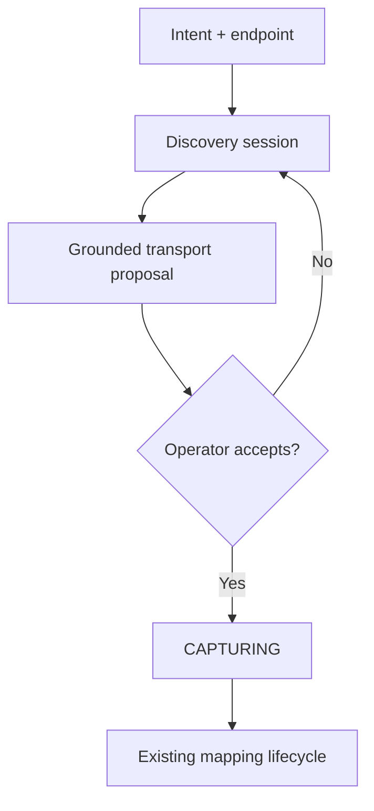

# ADR-0115: Conversational source discovery — one sentence, one endpoint, a scouted ingress

**Status:** Proposed — **revision 2**, amended against external review (design only; nothing
implemented)
**Date:** 2026-08-03
**Review:** `ADR-0115-CONVERSATIONAL-SOURCE-DISCOVERY-REVIEW.md` — *"Approve the product direction;
revise the architecture before implementation."* All ten blocking amendments are applied below and
mapped in §12.
**Owner directives (2026-08-03):** (a) the whole Ingress Studio programme is **premium** — zero new
OSS surface; (b) every artifact this produces is **modelled in the knowledge substrate**, not in a
private store.
**Amends in part:** the "exactly one stage is a form" premise of the turn-17 handoff
(`operator_ui_refactor/ingress studio/design_handoff_cambrian_ux/README-ingress-studio.md` §2.1) —
the form becomes a prompt plus an endpoint.
**Related:** ADR-0090 (ingress system), ADR-0092 (propose-don't-enforce), ADR-0101 (config/secret
store), ADR-0105 (evidence foundation), ADR-0108 (event-shaped knowledge), ADR-0110 (kind registry),
ADR-0111 (typed query plane), ADR-0112 (Ingress Studio foundations), ADR-0063 (LLM-condition
injection hardening), ADR-0084 (conversation model), ADR-0080 (chat daemon), SEC-01 (agent
sandboxing).

---

## Context

### What an operator does today

Creating an ingress starts with a form. The operator declares the transport by hand — kind,
endpoint, cadence, auth placement — and only then does the lifecycle take over:

```
DRAFT → CAPTURING → MAPPED → DRY_RUN → ARMED
```

Everything after that first stage is already review rather than authoring, and it is good: the
drafter proposes a mapping from the schema profile and redacted samples, abstains per-field when it
cannot decide, and cannot save, transition or arm what it proposed. A decision the operator makes
becomes *guidance* and the drafter re-proposes, so there is **one path into the mapping rather than
two that can disagree**.

The form is the weak point. It asks the operator to already know what they are about to connect to:
whether the endpoint paginates, what its rate limit implies about a poll interval, whether the JSON
array at the root is the collection or an envelope. That knowledge is *in the endpoint*, and a
person acquires it by opening a terminal and probing — which is exactly the work a machine should
do.

### The ask

> *"I want the earthquake data from that endpoint."* — plus a URL. Cambrian inspects the source,
> works out what kind of thing it is, proposes how to read it, **asks the operator the questions it
> cannot answer itself**, and hands a configured ingress to the existing lifecycle.

### The architectural thesis (adopted verbatim from the review)

> Source discovery is a bounded, versioned state machine over a security-owned probe capability. The
> model interprets operator intent and recorded findings; it never controls a general HTTP client.
> Its only output is a revisioned `TransportProposal`, grounded finding-by-finding in discovery
> evidence. Accepting that proposal is an operator command that enters the existing capture
> lifecycle.

### What already exists that this builds on

| Capability | Where | Why it matters here |
|---|---|---|
| Lifecycle state machine with three human gates | ADR-0112 | Discovery must not add a fourth path around them |
| Propose-only drafter with per-field abstentions | `ingressstudio/drafter.go` | The question-asking discipline already exists; this generalises it |
| Guidance loop (decision → guidance → re-propose) | drafter | The answer-handling model adopted wholesale |
| Redaction at capture (values → type tokens) | `schema_profile.go: Redact` | Constrains what discovery may keep, and what any transcript may show |
| Write-only credential store | ADR-0101 | The only correct destination for a fulfilled secret |
| Three transports: poller, webhook, websocket | `transport_*.go` | The closed vocabulary discovery classifies into |
| Evidence, with class and retention | ADR-0105 | Probe material is evidence, and is fenced off from source evidence |
| Event-shaped knowledge, streams | ADR-0108 | Where discovery's own artifacts live |
| **Kind registry — kinds are DATA** | ADR-0110 | Registering discovery kinds needs **no OSS code**; gate was "fourth source by configuration alone" |
| Typed query plane | ADR-0111 | *"Why is the cadence 60 s"* is answerable without a bespoke API |
| Payload-as-data nonce fencing | ADR-0063 | Reading untrusted remote text safely |
| Conversation / Message model | ADR-0084, ADR-0080 | Durable, scoped, authorised transcript — as a **view** |
| One-column studio UI: receipts, preconditions, abstention rows, sticky bar | turn 17 | The surface this lands in; almost nothing new to design |

---

## Decisions

### 1. Discovery is a stage 0 whose only output is a proposal. Capture is not skipped.

Discovery produces a **proposed transport spec**. It does not open a stream, does not ingest, and
does not shorten the lifecycle. `CAPTURING` runs afterwards exactly as it does today.

It will be tempting to skip capture — discovery has *seen* the payload, after all. That is the
single most damaging shortcut available here. One probe response is not a sample: it cannot show
that `properties.updated` equals `time` in 41 of 214 deliveries, which is precisely the class of
finding the studio exists to surface. **Discovery shortens the form. It must never shorten the
evidence.**

Corollary: discovery is propose-only, on the same terms as the drafter — it cannot save, transition
or arm. The three human gates are untouched.

### 2. Transport-only for v1. Discovery does not map. *(Amendment 1)*

Revision 1 said "transport only" in the open questions while Decision 2 let the model choose fields
and map into the kind registry. That contradiction is resolved in favour of transport-only.

Discovery's entire output is:

```text
DiscoverySession
├── ProbeFindings        (grounded, §5)
├── TransportProposal    (revisioned)
├── OpenQuestions
└── OperatorIntent       (the sentence, recorded verbatim)
```

`TransportProposal` may carry: transport kind, origin/URL, cadence candidate, pagination mechanism,
collection root, authentication placement, protocol and format hints, capture parameters.

**It must not carry an ADR-0110 knowledge-kind mapping.** The operator's sentence and any
field-relevance observations travel forward as **guidance for the existing drafter**, consumed
*after* real capture. They are not a mapping and cannot skip the drafter's abstention process.

One mapping authority. Probe-time guesses never compete with mappings derived from actual samples.

### 3. Everything discovery produces is modelled in the knowledge substrate. *(Owner directive b)*

Discovery has **no private store**. Its artifacts are event-shaped knowledge (ADR-0108) in an
operational stream, and its probe payloads are evidence (ADR-0105).

**Two streams, one model:**

| Stream | Contents | Projects to knowledge? |
|---|---|---|
| `ingress:<id>` | The source's domain deliveries, mapped by the drafter's accepted spec | **Yes** — this is the point of the ingress |
| `studio:<ingress-id>` | Discovery's own artifacts: sessions, probes, findings, questions, decisions, proposals | **No.** Operational, queryable, never projected |

**Registered kinds** (premium-owned, registered as *configuration* per ADR-0110 — no OSS code):

| Kind | Carries |
|---|---|
| `discovery.session` | intent, policy versions, terminal outcome |
| `discovery.probe` | one probe, its evidence refs, budget consumed |
| `discovery.finding` | field, proposed value, epistemic status, confidence, `rule_id`, evidence refs |
| `discovery.question` | shape, prompt, options, status, dependencies, proposal revision |
| `discovery.decision` | the answer, who made it, when, the constraint it produced |
| `discovery.proposal` | one `TransportProposal` revision and its diff |

**Why this is the right shape, and not merely tidy:**

- **Supersession comes free.** A question invalidated by a new finding, a finding revised by a later
  probe, an answer rebased onto a new proposal — the substrate already models "this was true, then
  it was not", bi-temporally. Review §5.2's concurrency and revision requirements are substrate
  behaviour rather than new code.
- **The query plane answers the audit question.** *"Why is the cadence 60 s"* is a query over
  `discovery.finding` → evidence, not a bespoke endpoint.
- **Retention is per-stream**, which is exactly what amendment 3 asks for (§4).
- **No second store to keep in step** with the ingress's own state.
- **It costs no OSS surface**, because ADR-0110 made kinds data. This is what reconciles owner
  directive (a) with owner directive (b).

**The fence that makes this safe:** the `studio:` stream is **non-projectable by construction** and
can never be a source for `save_to_memory`. Discovery cannot create knowledge items about the world.
It creates knowledge items about *itself*. Gate 7 and gate 14 assert this.

### 4. Retention: the structured record persists with the ingress; the transcript does not. *(Amendment 3)*

If questions and decisions are the artifact and chat is only a view, then the artifact — not the
transcript — is what deserves lifecycle-aligned retention. Keeping a non-authoritative transcript
forever contradicts the claim that it is non-authoritative.

**Retained with the ingress, in the `studio:` stream:** operator intent; question records and
normalized answers/constraints; proposal revisions and diffs; finding-to-evidence references;
acceptance and transition receipts; decision-maker identities and timestamps.

**Retained under ordinary conversation retention:** the conversational paraphrase. It may be
summarized or pruned without changing the ingress artifact — and gate 12 asserts exactly that.

This reduces sensitive-data exposure and *proves* the structured record is authoritative rather than
asserting it.

### 5. Findings carry epistemic status, not false certainty. *(Amendment 7)*

Revision 1 called several things "measured findings" that are hints. A `Cache-Control: max-age` is a
cache freshness lifetime, not a recommended poll interval. An `X-RateLimit-*` is a ceiling. Two
`Last-Modified` observations do not establish a stable interval. A `200` does not prove auth is
unnecessary. A repeated-shape array is a collection *candidate*.

```text
Finding {
  field
  proposed_value
  status: observed | inferred | assumed | operator_confirmed
  confidence
  rule_id
  evidence_refs[]
  explanation
  policy_bounds?
}
```

Only `observed` values are presented as fact. An inferred cadence is shown as a candidate with
policy bounds and its exact basis. The absence of an auth challenge produces **`auth_not_observed`**,
never `no_auth` — that distinction is gate 8.

### 6. Transport, protocol and format are three axes. *(Amendment 8)*

Revision 1's rule table mixed them, which would have let the closed transport vocabulary become an
accidental closed *format* vocabulary.

| Axis | Values |
|---|---|
| **Transport** | `poller`, `webhook`, `websocket` — closed, refuses by name |
| **Protocol / API style** | ordinary HTTP API, GraphQL, WebSocket handshake |
| **Representation / format** | JSON, GeoJSON, RSS, Atom, OpenAPI-described |

GraphQL is not a fourth transport; in this design it is usually a poller protocol. GeoJSON is a
format.

### 7. The model never owns an HTTP client. *(Amendments 5 and 6)*

Discovery calls a closed, security-owned command:

```text
ProbeSource {
  discovery_session_id
  target_url
  probe_kind                   // from a fixed enum
  credential_ref?              // reference only, never a value
  expected_proposal_revision
}
```

The model cannot choose methods, headers, bodies, redirect behaviour, proxy configuration or new
hosts. A deterministic controller decides which permitted probe comes next from recorded findings
and constraints.

**For v1 this is a bounded state machine, not an agentic network loop:**

1. probe the supplied endpoint
2. run deterministic classifiers
3. produce gaps
4. one model call — interpret operator intent against safe findings
5. ask batched questions
6. optionally one specifically-enabled follow-up probe
7. emit a proposal, or abstain

Reproducible, securable, benchmarkable and explainable, in a way "let the model plan network
exploration" is not.

**Network boundary** (application checks alone are insufficient):

- run probes in a dedicated process/network namespace or through a controlled egress gateway with
  **no route** to private or control-plane networks
- disable environment-derived proxies and ambient cookie jars
- HTTPS by default; HTTP requires an explicit operator decision
- restrict ports, schemes, URL userinfo, and redirect protocol changes
- **resolve, validate, then dial the validated IP** — never re-resolve at connect time; verify the
  connected peer address. "Resolve, check, then let the default client dial the hostname" has a
  DNS-rebinding/TOCTOU window
- cover IPv4, IPv6, IPv4-mapped IPv6, loopback, private, link-local, unspecified, multicast, and
  deployment-specific control-plane ranges
- cap DNS lookups, redirects, connections, **decoded and compressed** bytes, and wall time
- validate TLS normally against the intended hostname/SNI

**Credential scoping, stricter than Go defaults** (which forward sensitive headers to exact-domain
*and subdomain* matches):

- a credential is scoped to an exact origin — scheme, host, port
- **stripped on every redirect** by default
- never forwarded to subdomains automatically
- authenticating to a new origin requires explicit approval
- only the reference and scope are recorded, never the value

**Honest wording about safety** *(amendment in §3.4 of the review)*: HTTP defines `GET`/`HEAD` as
safe, but remote servers can violate that. The guarantee is therefore:

> Cambrian emits only permitted safe-method probes and never intentionally requests mutation. Remote
> server behaviour is outside Cambrian's transactional control.

**No recursive dereferencing.** External OpenAPI `$ref`s, response examples, callback URLs, server
URLs, feed links, embedded resources — all data, none fetched. No JavaScript execution. Any
same-origin well-known candidate list is finite, explicit, versioned, and charged against the same
budget.

Narrow consequences for two signals revision 1 listed carelessly:

- **OpenAPI discovery** starts at the exact supplied URL. `/openapi.json` and `/swagger.json` are
  conventions, not guarantees; `/.well-known/` is not a directory to sweep.
- **GraphQL introspection** conflicts with safe-method-only probing. v1 either sends one bounded
  GET-encoded introspection query when the endpoint explicitly appears to be GraphQL and fits all
  limits, or detects "possible GraphQL" and asks. It never silently POSTs a query body.
- **WebSocket** gets its own bounded probe type with no sustained stream — or, in v1, is inferred
  only from an explicit `ws:`/`wss:` endpoint with handshake verification left to capture setup.

### 8. A question is a first-class record. Chat is a view. *(Retained, strengthened)*

Every question has a home at the stage it belongs to, carrying: id, stage, shape, prompt, options,
status (`open` / `answered` / `superseded` / `withdrawn`), answer provenance, dependencies, and the
**proposal revision it was asked against**.

**If the column and the thread disagree, the column wins.** This is a tested invariant, not a
convention.

Concurrency, per amendment in review §5.2 — and, per Decision 3, mostly inherited from the
substrate: `proposal_revision_id` and `expected_question_version` on answer commands; idempotency
keys; atomic status transitions; automatic supersession when a new finding invalidates a question;
immutable decision history. **An answer against a superseded proposal is rejected or explicitly
rebased — never silently applied to the latest revision.**

### 9. Question shapes are closed, and `secret` is a schema-level capability path. *(Amendment 9)*

| Shape | Renders as | Answer goes to |
|---|---|---|
| `choice` | The existing abstention row — options plus explicit "none of these" | Constraint set |
| `confirm` | Yes/no with the consequence stated in the question | Constraint set |
| `free_text` | Input with typeahead over prior answers | Constraint set, **after normalization** |
| `secret` | Write-only field | **Credential service only — see below** |
| `do_then_tell` | Instruction + system-verified completion | Constraint set |

**A secret question has no answer field.** This is a schema-level union, not a convention:

- the browser submits **directly to the credential service**
- the conversation/question API never receives the secret
- the model never receives it
- the question stores only a fulfillment receipt or opaque credential reference
- logs, events and traces expose credential type, scope and attachment status only
- replacement or revocation creates a new auditable credential revision
- **the question closes when the reference is attached and, where possible, verified by a permitted
  probe** — not because a text answer claimed it was added

**Free text still needs normalization** *(review §5.3)*: every free-text answer is parsed into a
typed constraint, or retained as guidance that cannot directly set stored transport fields. If
normalization fails the question stays open with a named reason.

**Assumptions are records** *(review §5.4)*: a reversible cosmetic assumption is stored explicitly as
an `assumption` with source, reason, affected field and replacement behaviour. Never a silently
filled blank.

### 10. An answer is a decision of record, and never a second path into the spec.

> `geometry.coordinates → lon, lat, depth` — *you chose this on 3 Aug; the drafter abstained because
> the payload documents neither ordering.*

An answer becomes a **constraint**; the session **re-proposes**; the operator sees the diff. Chat
never edits a spec directly. This is the drafter's existing discipline extended — one path in,
rather than two that can disagree.

The corollary is useful: an operator can volunteer something unprompted — *"actually it paginates,
use the cursor field"* — and it is simply another constraint, which may supersede a question the
session believed settled.

**Batching:** independent questions arrive together; serialize only when the answer changes what
would be probed next. Answers accumulate and the session re-proposes **once** — which also resolves
the turn-17 handoff's open question #2, because resolving the second abstention must never discard
the first.

### 11. Inbound sources: acceptance first, then the lifecycle mints. *(Amendment 2)*

Revision 1 let discovery mint an endpoint and secret and begin waiting — which is state-changing,
and contradicts propose-only. Corrected sequence:

1. discovery proposes `webhook` plus the required inbound configuration
2. the operator **accepts** the proposal
3. the lifecycle transitions the draft into `CAPTURING`
4. **a studio command — not the model —** mints the endpoint and credential
5. deliveries enter the normal evidence-first path
6. the first-delivery precondition resolves **from system evidence**, not from "tell me when done"

A `do_then_tell` question may walk an operator through configuring a third-party service, but it
closes only when Cambrian verifies the expected delivery or configuration state.

Temporary inbound endpoints require explicit expiry, tenant scope, rate limits, revocation, and a
state that prevents projection before the ordinary gates pass.

### 12. Discovery evidence is protected, versioned and non-projectable. *(Amendment 10)*

Probe material is auditable but is **not source data**. Documentation, error pages, login forms and
rate-limit responses must never reach knowledge projection.

Evidence class `discovery_probe`, non-projectable by default, in two layers:

1. **Restricted raw probe evidence** — kept where audit or re-derivation requires it; encrypted,
   under explicit retention and access policy.
2. **Redacted probe observations** — safe for deterministic rules, model context, UI and
   conversation.

Request credential values are never recorded. Response material is redacted: `Set-Cookie`,
auth challenges carrying tokens, signed redirect URLs, provider-specific secret headers. A finding
points at the protected record *and* the safe derived observation.

**Version pinning per proposal revision:** discovery policy version, rule-engine version, probe
implementation version, model configuration. Without it, re-derivation becomes impossible after any
code change.

### 13. Placement: entirely premium. Zero new OSS surface. *(Amendment 4 + owner directive a)*

ADR-0112 already places the studio in premium, with the plugin ID as the entitlement key. This
programme adds nothing to OSS:

- **Source discovery** — premium.
- **Question and decision records** — premium studio domain. Revision 1 proposed an OSS port on the
  grounds that questions might serve other propose-only agents; that is speculative, and both
  current consumers (discovery questions, mapping abstentions) belong to the studio. A generic
  question/decision port is promoted to OSS only when a second, *independent* core consumer
  demonstrates the same semantics — and then by its own ADR.
- **Discovery kinds** — registered as configuration against the existing ADR-0110 registry. No OSS
  code. This is what makes owner directives (a) and (b) compatible rather than opposed.
- **Substrate primitives** — Evidence, streams, kinds, the query plane — are *used*, not extended.

### 15. Where the loop runs: Go controller, with Python reserved for real exploration. *(Owner question, 2026-08-03)*

**Recommendation: the v1 controller is Go, inside the premium studio plugin. There is no Python
system agent in v1 — because Decision 7 removed the thing that would have needed one.**

The reasoning turns on what the loop actually became. Once discovery is a *bounded state machine
with one model call*, there is no multi-step reasoning process to host: the sequencing, budgets,
probe selection, constraint accumulation, proposal revisions and substrate writes are all
deterministic control flow, and the single interpretation step is a generator call that the drafter
already makes from Go today. Shipping a Python process to make one LLM call would add process boots
per session, a second requirements surface (PLAT-01), and a second place where the guidance model
lives — for no capability.

Split by **trust**, not by language:

| Concern | Home | Why |
|---|---|---|
| Probe capability, egress guard, dial-time enforcement | **Go**, security-owned | It is the security boundary; it cannot live where the model runs |
| State machine, budgets, probe sequencing | **Go**, plugin | Deterministic, must be reproducible and benchmarkable |
| Deterministic classifiers | **Go**, plugin | Same test harness as the rest; fixtures, no model |
| Question/decision records, substrate writes | **Go**, plugin | Kinds, evidence and streams are Go-side |
| Intent interpretation (one call) | **Go**, via the existing generator seam | Sibling of the drafter; must share its guidance model |

**When Python becomes right — and why it is then the *safer* option.** If a later version wants
genuine multi-step exploration (hypothesis, targeted follow-up, revision), a Python system agent
shipped inside the studio plugin is the correct home: sandboxed under SEC-01's env allowlist and
memory caps, versioned by its own manifest and requirements, and swappable without touching the
kernel.

Critically, that arrangement makes Decision 7 **structural rather than a code-review rule**. A
sandboxed Python agent has no egress of its own; it can only *ask the kernel to probe* through the
closed `ProbeSource` command. "The model never owns an HTTP client" stops being a discipline
somebody could accidentally violate and becomes a property of the process boundary.

So the owner's instinct is right about the destination and early about the timing. Phase 4 builds
the Go state machine; a Python agent is the natural v2 upgrade path, and the `ProbeSource` contract
is designed now so that swapping the controller later requires no change to the security boundary.

**Open for sign-off** — this is load-bearing and reversible only at cost. See Open Question 5.

### 14. Naming: **Source Discovery**. *(Review §10)*

Neither `Scout` (collides with the orchestration lane) nor `Prospector` (forces a metaphor into
durable event names). The plain term is clearer to operators and stable in the API vocabulary:

```text
source_discovery.started
source_discovery.probed
source_discovery.question_opened
source_discovery.proposed
source_discovery.accepted
source_discovery.abstained
```

---

## The procedure, end to end

**1 — The operator states intent.** A sentence and a URL. The sentence is recorded verbatim as
`OperatorIntent` — not a spec, but the thing the proposal is judged against and the reason later
readers get for why the transport looks as it does.

**2 — The session probes, under budget, through the constrained capability.** `HEAD`, then `GET`.
Every request and response pair becomes `discovery_probe` evidence in two layers.

**3 — Deterministic classifiers derive findings.** Transport, protocol and format on separate axes;
each finding carries its epistemic status, confidence, rule id and evidence refs.

**4 — One model call interprets intent against safe observations.** It sees redacted observations
inside an ADR-0063 fence. It proposes naming and relevance ordering — **not a mapping**.

**5 — Uncertainty becomes batched questions.** A `401` becomes a `secret` question and a stage
precondition: *"needs a bearer token — add one and this continues on its own."*

**6 — The operator answers.** Answers become constraints; the session re-proposes once; the diff
between proposal revisions is visible.

**7 — Acceptance is an operator command.** The transport spec is saved as a revision. Stage 0
collapses to a receipt carrying its finding — `poller · every 60 s (candidate, from Cache-Control)
· auth not observed · collection at /features`. The lifecycle proceeds to `CAPTURING`, unchanged.
For inbound sources, this is where the endpoint is minted (§11).

**8 — Mapping, as today.** The existing drafter takes over from real captured samples, carrying the
operator's intent forward as guidance. Its abstentions are the same question records, in the same
rows, answered the same way. From here nothing in this ADR applies — which is the point.

### Lifecycle



**Ownership rules.** Discovery attaches to a *draft ingress*; it is not an alternative lifecycle. The
security-owned prober performs network actions. The deterministic classifier derives findings from
recorded observations. The model interprets intent and proposes human-facing guidance. An operator
command accepts and saves a transport revision. Ordinary ingress machinery owns endpoint creation
and capture. The existing drafter owns mapping once real evidence exists. **Nothing in discovery
writes to the ADR-0108 domain knowledge substrate.**

---

## Where it lands in the UI

Almost nothing new is designed. Turn 17's vocabulary already covers it:

| Discovery concept | Existing turn-17 element |
|---|---|
| Session conclusion | Stage 1 **receipt carrying its finding** |
| Ungrounded value | **Abstention row** with typed options |
| Missing credential | **Precondition row**: "needs a bearer token — add one and this opens on its own" |
| Open question count | The **sticky bar**'s "N decisions left" |
| Probe trace | A log view, same pattern as the pipeline step trace |
| Finding epistemic status | Tone and wording: `observed` reads as fact, `inferred` as a candidate with its basis |

The conversation thread docks at the **bottom of the column**, expanding upward over the stages —
**never over the evidence pane**, which stays pinned because it is the material every claim is
checked against.

---

## Implementation plan

Ordered so each phase is useful alone and the risky parts are proven before the expensive ones.
Phases 0–3 contain no model at all.

| # | Phase | Contents | Ends in |
|---|---|---|---|
| **0** | **Expressiveness + threat-model audit** | Transport-schema audit (can it *hold* cursors, auth placement, collection root, derived cadence?); exact `TransportProposal` schema; finding epistemic states; probe capability contract; URL/origin/credential scoping rules; discovery-evidence classification and retention; permission model for probing and credential attachment; the `studio:` stream and kind registrations | **An amended ADR, not code** |
| 1 | Question records, in premium | Back the *existing* drafter abstentions with versioned questions — proving the model on something already shipping. Optimistic concurrency, supersession, typed constraints, secret-question union, normalized decision history. **No OSS port** | Working studio, no behaviour change |
| 2 | Hardened probe service | Network boundary, adversarially tested, independent of model and UI. Network isolation plus dial-time enforcement. Emits restricted raw evidence and safe observations | A capability, callable by nothing yet |
| 3 | Deterministic classifier | Over recorded fixtures only. Transport/protocol/format separated; grounded findings with confidence; abstention is a valid result | Fixtures pass, no model |
| 4 | Outbound discovery session | Bounded state machine over 2+3. Intent interpretation, batched questions, constraint accumulation, proposal revisions, explicit operator acceptance | End-to-end poller creation |
| 5 | UI + conversation projection | Questions inline and in the ADR-0084 thread. Prove transcript pruning does not change the artifact. Secrets routed directly to the credential service | The turn-17 column, filled in |
| 6 | Inbound capture handover | After acceptance, the lifecycle mints the endpoint and enters `CAPTURING`. Operator setup verified from delivery evidence | Webhook path |

**Not code generation.** ADR-0112's v1 rule holds: *configuration, not code*. Discovery
parameterises human-written generic transports. It never emits a transport.

---

## What this deliberately does not do

- **No arming.** Three human gates, unchanged.
- **No capture shortcut.** §1.
- **No mapping from discovery.** §2.
- **No knowledge items about the world.** Discovery describes only itself. §3.
- **No general HTTP client for the model.** §7.
- **No recursive fetching** of references, links or embedded resources. §7.
- **No new transports.** Refuses by name.
- **No Slack/email as sources in v1.** OAuth app install, tenant consent, per-workspace scopes — an
  integration project, not a discovery feature. Named as a refusal until then.
- **No secret in any transcript, event, trace, log or model input.** §9.
- **No OSS surface.** §13.
- **No chat-first product.** The thread is a means; the column is the surface.

---

## Open questions

Revision 1 carried five. Three are now settled by the review and are recorded as decisions above
(transport-only → §2; endpoint minting → §11; thread lifetime → §4). What remains:

1. **May a session ask questions after arming?** Recommendation: not during normal operation; yes
   while a revision is being drafted, which fits 17b — a fork is the only thing that can be in
   progress on something armed.
2. **Does an unanswered question block?** Recommendation: block anything that changes stored data;
   proceed with a *stated, visible, reversible* `assumption` record (§9) for cosmetics such as
   naming.
3. **Phase 0's answer.** Genuinely unknown until the transport spec schema is read. If it cannot
   hold what discovery finds, the classifier keeps discovering things it cannot write down — and
   that constraint must shape the design rather than surface mid-build.
4. **Does the `studio:` stream need its own retention policy distinct from the ingress's?** Probably
   yes for probe evidence (short) versus decisions (lifecycle-aligned), but that is a Phase 0
   determination.
5. **Go controller or Python system agent?** Recommendation in Decision 15: Go for v1, because the
   bounded state machine has nothing for a Python process to do that Go does not already do; Python
   when multi-step exploration arrives, at which point the sandbox makes the "no HTTP client for the
   model" rule structural. **Needs owner sign-off before Phase 4.**

---

## Gates

### Original

- Phase 0 produces a written yes/no per finding type, naming the schema gap where it is "no".
- The classifier is tested against recorded fixtures from at least three unrelated public APIs, with
  **no model in the loop**.
- A discovery run ending in abstention is a **passing** test case.
- Every proposed value is traceable to a stored probe. A proposal that cannot name its evidence is a
  defect.

### Added by review

1. The model has no API accepting an arbitrary method, body, header, host or redirect target.
2. DNS is validated at connection time and the connected peer IP is checked.
3. IPv6, IPv4-mapped IPv6, proxy environment variables, alternate ports, URL userinfo and protocol
   downgrade are covered by adversarial tests.
4. Credentials are never forwarded across an origin change, nor automatically to a subdomain.
5. Compressed **and** decompressed response sizes are both budgeted.
6. External OpenAPI references and document links are not fetched.
7. Probe evidence is marked non-projectable and cannot reach `save_to_memory`.
8. A 200 response produces `auth_not_observed`, not `no_auth`.
9. Cache and rate-limit headers produce cadence **candidates**, not unquestioned facts.
10. Secret values are absent from model input, question answers, conversations, events, traces,
    metrics, ordinary logs and redacted observations.
11. Concurrent answers cannot overwrite one another or apply to superseded proposals.
12. Transcript pruning leaves questions, constraints, proposals, evidence references and decisions
    intact.
13. No endpoint or secret is minted before the operator accepts an inbound transport proposal.
14. Discovery cannot create knowledge items or bypass `CAPTURING`, `DRY_RUN` or arming gates.
15. Re-running discovery creates a new proposal revision and a visible diff, rather than mutating
    accepted history.

### Added by owner directives

16. No new OSS package, port, proto message or exported symbol is introduced by this programme;
    discovery kinds are registered as configuration only.
17. Every discovery artifact is retrievable through the ADR-0111 query plane — no bespoke read API.
18. The `studio:` stream is structurally barred from domain projection, asserted by test.

---

## §12 — Review amendment map

| # | Review amendment | Where applied |
|---|---|---|
| 1 | Transport-only for v1 | Decision 2 |
| 2 | Inbound minting after acceptance | Decision 11 |
| 3 | Transcript under conversation retention; decisions with the ingress | Decision 4 |
| 4 | Questions stay premium | Decision 13 |
| 5 | Constrained probe capability, not a general client | Decision 7 |
| 6 | Dial-time SSRF controls, exact-origin credentials | Decision 7 |
| 7 | Findings distinguish observed/inferred/assumed/confirmed | Decision 5 |
| 8 | Transport, protocol and format as separate axes | Decision 6 |
| 9 | Secret fulfillment is a capability path, not an answer | Decision 9 |
| 10 | Discovery evidence protected, versioned, non-projectable | Decision 12 |
| — | Naming: Source Discovery | Decision 14 |
| — | *Owner:* whole programme premium | Decision 13 |
| — | *Owner:* everything in the knowledge data model | Decision 3 |
